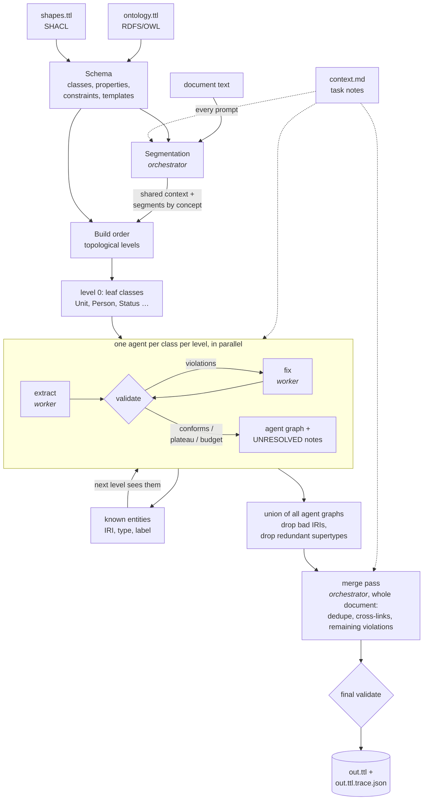
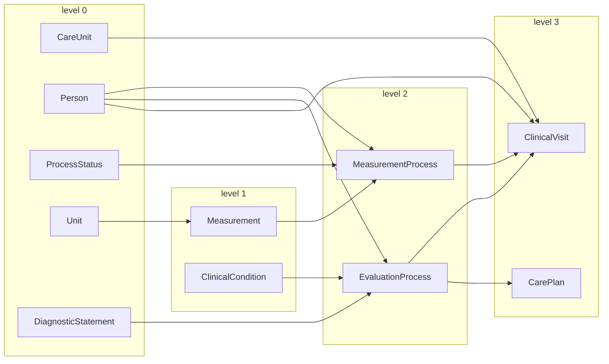
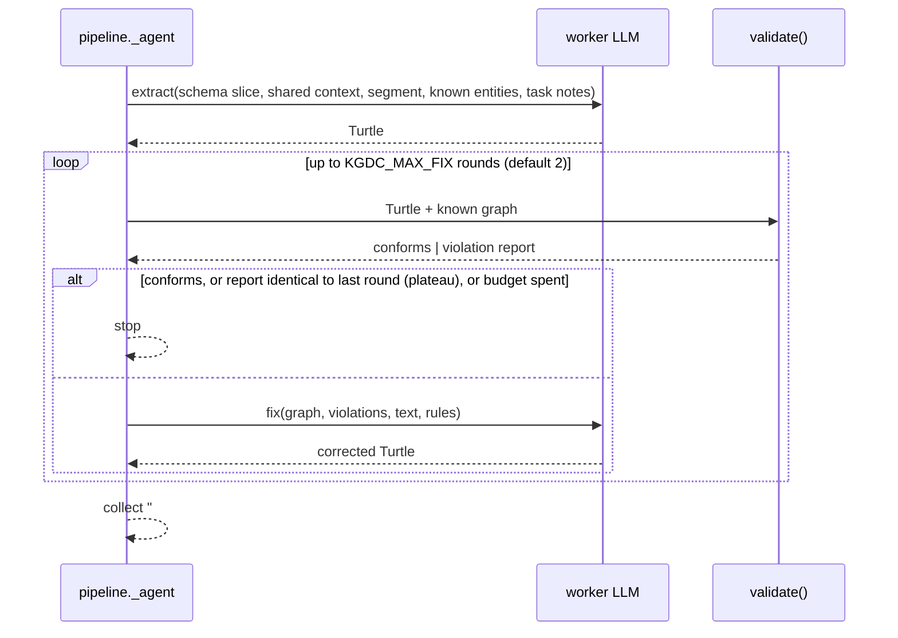
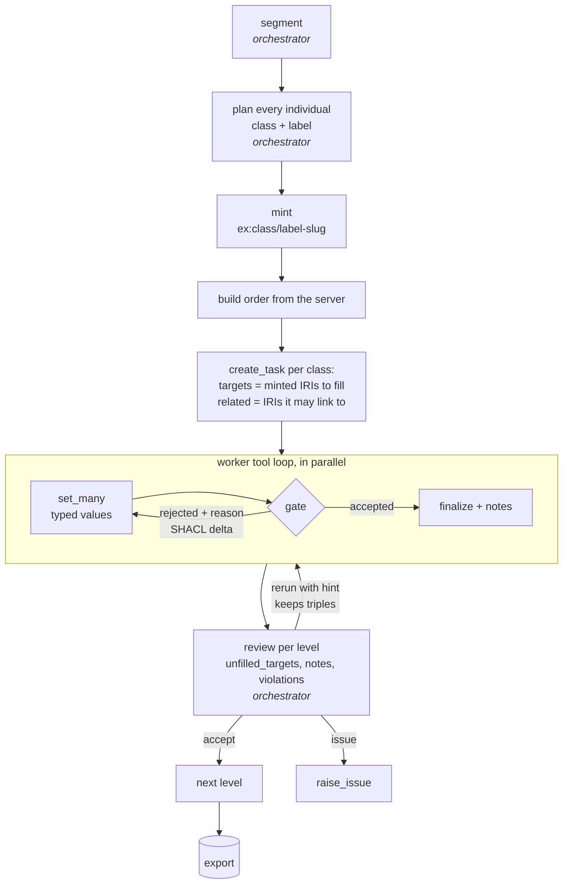

# kgdc — divide-and-conquer knowledge-graph extraction

Turn a text document into an RDF graph that conforms to **any** ontology (RDFS/OWL) and
SHACL shapes you hand it, without inventing facts. The document is split into segments by
ontology concept, one LLM agent builds the graph for each class in dependency order, every
agent output is validated (closed-world vocabulary check + SHACL) and repaired, the pieces are
unioned, and one orchestrator pass over the whole document merges duplicates and adds the links
no single agent could see.

Nothing in the prompts is domain-specific: the ontology drives segmentation and build order,
the shapes drive slot filling, and an optional plain-text *context file* carries the naming
conventions a schema cannot express. The same code runs on clinical vignettes, WebNLG DBpedia
categories and pharmacology case reports (see [Results](#results)).

**Agents never fabricate.** If a constraint requires something the text does not state, the agent
leaves the slot empty and writes `# UNRESOLVED: <what> — not stated in the text`. A graph with
honest gaps beats a conformant graph with invented values.

**Results at a glance** (gemma4-g1 27B for both roles, ordered mode; details and methods in
[Evaluation](#evaluation) and [Results](#results)):

| corpus | docs | metric | kgdc | original pipeline (gpt-oss-120b, same scorer) |
|---|---|---|---|---|
| CHR clinical vignettes (interim, pass 1) | 157 | identity-hash triple F1, macro | **0.804** | A 0.312 · B 0.307 · D 0.339 |
| CHR clinical vignettes | 157 | same, micro | **0.744** | A 0.304 · B 0.302 · D 0.322 |
| WebNLG Airport | 20 | label triple F1, macro | **0.948** | — |
| WebNLG Building | 20 | label triple F1, macro | **0.838** | — |
| ADE corpus (drug → adverse effect) | 20 | label triple F1, micro, strict / lenient | **0.52 / 0.80** | — |
| WebNLG Airport, **held-out** docs 21-40 | 20 | label triple F1, macro, strict / lenient | **0.866 / 0.957** | — |
| WebNLG Building, **held-out** docs 21-39 | 19 | label triple F1, macro, strict / lenient | **0.903 / 0.945** | — |
| ADE corpus, **held-out** docs 21-40 | 20 | label triple F1, macro, strict / lenient | **0.610 / 0.759** | — |

Per-document scores for every system are in `results/2026-09-21/`; the extracted graphs, traces and logs of the
200-document batch are in `runs/chr-2026-09-21/` (`pass1/` and `truncated/` keep the outputs replaced by the second pass and by the repair script).

---

## Contents

1. [Quick start](#quick-start)
2. [Repository layout](#repository-layout)
3. [How the pipeline works](#how-the-pipeline-works)
   1. [Schema: from ontology + shapes to prompt material](#1-schema-from-ontology--shapes-to-prompt-material)
   2. [Segmentation (orchestrator)](#2-segmentation-orchestrator)
   3. [Build order](#3-build-order)
   4. [Class agents: extract → validate → fix](#4-class-agents-extract--validate--fix)
   5. [Validation](#5-validation)
   6. [Union, cleanup and the merge pass](#6-union-cleanup-and-the-merge-pass)
   7. [Outputs and trace](#7-outputs-and-trace)
4. [Modes](#modes)
5. [The task context file](#the-task-context-file)
6. [Adding a new vocabulary](#adding-a-new-vocabulary)
7. [Evaluation](#evaluation)
8. [Results](#results)
9. [Configuration reference](#configuration-reference)
10. [Tests](#tests)
11. [Lessons and troubleshooting](#lessons-and-troubleshooting)
12. [Data and licences](#data-and-licences)

---

## Quick start

```bash
uv venv && uv pip install -e ".[dev]"      # Python ≥ 3.11: rdflib, pyshacl, openai, python-dotenv
cp .env.example .env                        # LLM_API_KEY / LLM_BASE_URL / LLM_MODEL (+ LLM_BIG_* for the orchestrator)

# one clinical vignette, ordered mode (recommended), with the CHR conventions file
python -m kgdc examples/chr/ontology.ttl examples/chr/shapes.ttl examples/chr/docs/vignette_065.txt \
    --ordered --context examples/chr/context.md -o out/vignette_065.ttl

# score it against the gold ABox (identity-hash triple F1)
python examples/chr/score.py out/vignette_065.ttl examples/chr/docs/vignette_065.gold.ttl

pytest                                      # offline: stub LLM, no network
```

The CLI:

```
python -m kgdc ONTOLOGY.ttl SHAPES.ttl TEXT.txt [-o OUT.ttl] [--ordered | --mcp]
                [--context NOTES.md] [--workers 4] [-q]
```

| flag | meaning |
|---|---|
| `-o OUT.ttl` | final Turtle; the trace goes to `OUT.ttl.trace.json` (default: print Turtle to stdout) |
| `--ordered` | bottom-up: one agent per class per dependency level, later levels reuse earlier entities (**use this**) |
| `--mcp` | tool-gated plan → mint → fill mode through the Rust MCP server (small workers; experimental) |
| `--context F` | text/markdown file with domain conventions, injected into every prompt as TASK NOTES |
| `--workers N` | parallel agents per level (default 4) |
| `-q` | no progress lines on stderr |

Exit status is 0 when the final graph conforms, 1 otherwise. Progress, unresolved notes,
violations and token/cost usage per role are printed on stderr.

From Python:

```python
import kgdc
schema = kgdc.load("examples/chr/ontology.ttl", "examples/chr/shapes.ttl")
result = kgdc.run_ordered(schema, open("doc.txt").read(), workers=4, task=open("context.md").read())
result.ttl, result.conforms, result.violations, result.unresolved, result.segments, result.usage
```

---

## Repository layout

```
kgdc/                      the Python package
  __main__.py              CLI
  schema.py                ontology + shapes → Schema (classes, properties, constraints, templates, build order)
  prompts.py               every prompt: segment, extract, fix, merge, verify
  pipeline.py              run() flat mode, run_ordered() ordered mode, agents, union, merge, cleanup
  validate.py              Turtle parse → closed-world vocabulary check → SHACL (pySHACL)
  llm.py                   OpenAI-compatible client, two roles (worker / orchestrator), retries, usage
  mcp_pipeline.py          --mcp mode: plan → mint → fill through kgdc-mcp
  mcp_client.py            minimal JSON-RPC/stdio client for kgdc-mcp
  progress.py              timestamped stderr log
kgdc-mcp/                  Rust MCP server: shared graph, per-triple gate, SHACL (shacl-rust)
examples/
  chr/                     clinical vignettes: ontology, shapes, context, 200 docs + gold, scorer, batch runner, comparison
results/                   score files and comparison tables per date
runs/                      full batch outputs: per-document Turtle, trace (segments, agent cycles, violations), log
  webnlg/                  WebNLG downloader/extractor and the generic label-level scorer
  webnlg-airport/          WebNLG "Airport": ontology, shapes, context, 20 docs + gold
  webnlg-building/         WebNLG "Building": same
  ade/                     ADE corpus (drug → adverse effect): ontology, shapes, context, prepare script, 20 docs + gold
tests/                     offline tests (stub LLM) and MCP server tests
NOTES.md                   55 numbered findings from the runs: what failed, what fixed it
```

---

## How the pipeline works

The ordered mode end to end:



Two LLM roles are used: **workers** (`LLM_*`) do extraction and fixing on one class at a time;
the **orchestrator** (`LLM_BIG_*`, falls back to the worker settings) segments and merges, i.e. the
two calls that need the whole document. They can be the same model.

### 1. Schema: from ontology + shapes to prompt material

`kgdc.schema.load(ontology, shapes)` reads both files with rdflib and produces a `Schema`:

| field | source | used for |
|---|---|---|
| `classes` (qname → "label — comment (subclass of …)") | `owl:Class` / `rdfs:Class` | concept list for segmentation, class list for agents |
| `properties` (qname → "(domain \| … -> range \| …): comment") | `rdf:Property`, `owl:*Property` with `rdfs:domain` / `rdfs:range` | property list, templates, build order |
| `constraints` (class → slot lines) | `sh:NodeShape` with `sh:targetClass` and its `sh:property` shapes | "MUST have 1..n", datatype, class, nodeKind, pattern, message |
| `parents` | `rdfs:subClassOf` | inherited properties, subclass-aware dependencies |
| `terms` | every declared class/property IRI | the closed world for validation |
| `prefixes` | only namespaces actually used, plus `ex:`, `rdf:`, `rdfs:`, `xsd:` | prefix block in every prompt |
| `unlinkable` | classes that are never a domain or range, nor a subclass of one | removed from the agents' menu (abstract roots, leftovers) |

Rendering helpers turn this into prompt blocks: `concept_block()` (what exists and how to
recognise it), `property_block()` (domain → range), `constraint_block()` (what the validator
demands), and `skeleton_block()`: **one Turtle template per class** generated from the
vocabulary, with a placeholder typed by the property's range or the SHACL datatype:

```turtle
ex:Measurement_1 a chr:Measurement ;
    rdfs:label "..." ;
    chr:hasCode <https://example.org/replace-with-the-real-iri> ;
    chr:hasMeasuredDate "..."^^xsd:dateTime ;
    chr:hasQuantityValue "..."^^xsd:float ;
    chr:hasUnit ex:Unit_1 .
```

`Schema.subset(concepts)` gives an agent only the slice it needs: its classes, their (inherited)
properties, and the range classes two hops out (Process → Measurement → Unit). Validation is
always against the whole vocabulary (`terms` stays complete).

`Schema.dependencies(cls)` is the set of classes an instance may link to (ranges of its inherited
properties **and their subclasses**); `Schema.build_order()` sorts classes into levels with
`graphlib.TopologicalSorter` so that a class comes after everything it links to. A cycle lands both
classes in the same level.

### 2. Segmentation (orchestrator)

One call (`prompts.segment`) with the concept list and the document returns JSON:

```json
{"shared_context": "<verbatim header facts every segment needs>",
 "segments": [{"id": "s1", "concepts": ["chr:ClinicalVisit", "chr:Person"], "text": "<verbatim span>"}, ...]}
```

Three rules the prompt enforces, each learned from a failed run (NOTES 2, 6, 27):

- spans and shared context are **verbatim**; a paraphrased span is where facts get invented, so
  every span is checked against the document (`verbatim` flag in the trace);
- verbatim spans are **snapped to whole sentences** (`_whole_sentences`), because segmenters drop
  the leading "On <date>, …" clause that carries exactly what a constraint asks for;
- if the shared context itself describes an instance (the visit, the encounter), it must **also**
  be a segment, otherwise nobody builds it.

`json_call()` tolerates the JSON that real models return: fences, a truncated tail, one malformed
element in a list (skipped, resynced at the next `{`), one retry with a "JSON only" reminder. If
segmentation is unusable, the whole document becomes one segment.

### 3. Build order

Only the classes that segments mention (plus what they depend on) are built. For the CHR
vocabulary:



Each level runs its agents in parallel (`--workers`). Before a level starts, every individual built
so far is rendered as **KNOWN ENTITIES** (`IRI a Class ; rdfs:label "…"`) and passed to the agents,
which must link to those IRIs instead of minting new ones. The agent's graph is validated together
with the known graph, so a link to a known IRI satisfies `sh:class` constraints.

Agents at the **last level** (the containers: visit, care plan) receive the whole document instead of
their own segment, because the links from a container to everything built before are stated all
over the document, not in the container's own sentence (NOTES 45).

### 4. Class agents: extract → validate → fix



The extract prompt (`prompts.extract`) contains, in order: the scope ("output only individuals of
type X plus what they link to"), prefixes, classes, properties, SHACL constraints, the Turtle
templates, seven rules (declared terms only; IRIs named from the text so the same thing gets the
same IRI; type and label on every individual; literals copied exactly with the datatype the
constraint names; IRIs where a constraint asks for one; codes through the code property; never
fabricate), the task notes, the known entities, the shared context and the segment.

The fix prompt shows the violations and insists that **formatting** violations are always fixable
(the value is already there, only its form is wrong) while **missing facts** are not: keep the graph
as it is and add an UNRESOLVED note. The loop stops at conformance, when the violation report repeats
(the agent is honestly stuck) or when the budget is spent.

An exception from the LLM (context window, dead endpoint) finalises **that agent** with a note and an
`error` field in the trace; the document still gets a graph from the other agents (NOTES 46). The
SHACL report inside a fix prompt is capped (`KGDC_MERGE_MAX_CHARS`) because a verbose pySHACL report
once blew a 32k context.

Optional per-segment **verifier** (`KGDC_VERIFY=1`): one extra worker call that numbers the agent's
triples and asks which ones the text does not support (dropped by index, so it can only remove) and
which stated facts are absent (forwarded to the merge pass). Measured net negative on a worker that
does not hallucinate (NOTES 39); off by default.

### 5. Validation

`validate.validate(ttl, schema)` runs three checks and renders every problem in the pySHACL
"Constraint Violation" block format so the fix prompt sees one consistent report:

1. **Turtle parse.** A syntax error is reported with the offending line and a hint (every statement
   starts with a subject IRI; local names use letters, digits, `_`, `-`).
2. **Closed-world vocabulary** (`vocabulary_violations`): every predicate must be a declared
   property (or `rdf:type`, `rdfs:label`, `rdfs:comment`), every `rdf:type` object a declared class,
   and no IRI may contain characters that are illegal in an IRI (`_BAD_IRI`: whitespace, `<>"{}|\^`` `,
   a bare `%`). rdflib accepts such IRIs; OWL tools downstream silently truncate around them and
   SHACL validators refuse the file, so they are rejected at the gate (NOTES 10).
3. **SHACL** with pySHACL, the ontology as `ont_graph` (so `sh:class` sees subclass axioms),
   `advanced=True`, warnings and infos ignored. pySHACL's SPARQL parser is not thread-safe, so this
   runs under a lock.

### 6. Union, cleanup and the merge pass

- **Union** (`_union`): every parseable agent graph is added to one rdflib graph; unparseable
  outputs are kept as text for the merge pass (facts must not vanish silently). Triples with illegal
  IRIs are dropped because rdflib can parse but not serialise them.
- **Redundant supertypes** (`drop_redundant_types`): `x a MeasurementProcess, MedicalProcedure`
  becomes `x a MeasurementProcess`. Models add the range class next to the real one; it is entailed
  anyway and re-keys the node under identity-hash scoring (NOTES 45).
- **Merge pass** (`_final`, orchestrator): the whole document, the union graph, the remaining
  violations (capped), the UNRESOLVED notes and any unparsed agent text. It merges duplicates,
  adds cross-segment links the document states, removes what the document does not support and
  resolves violations where it can. If the call fails (context window, timeout), the union is
  returned as the result with `error` set. The result is cleaned again and validated.

### 7. Outputs and trace

`-o out.ttl` writes the final graph; `out.ttl.trace.json` is the full provenance:

```json
{"ttl": "...", "conforms": true, "violations": "", "unresolved": [],
 "segments": [{"id": "chr:Measurement", "level": 1, "concepts": ["chr:Measurement"], "text": "...",
               "cycles": [{"cycle": 0, "conforms": false, "violations": "..."}, {"cycle": 1, "conforms": true, "violations": ""}],
               "ttl": "...", "unresolved": [], "llm_calls": 2, "shared_context": "...", "build_order": [["chr:Unit", ...], ...]}],
 "llm_calls": 11, "usage": {"worker": {"calls": 9, "prompt_tokens": 28256, "completion_tokens": 5716, "cost": null, "model": "..."},
                            "orchestrator": {...}, "total": {...}}, "error": null}
```

---

## Modes

| mode | flag | what differs | when |
|---|---|---|---|
| flat | (none) | one agent per **segment**, all in parallel, then merge | small documents, quick look |
| ordered | `--ordered` | one agent per **class** per dependency level; later levels see earlier entities; last level sees the whole document | **default choice**: best F1, links land, ~10-25 LLM calls per document |
| tool-gated | `--mcp` | orchestrator plans and mints every individual; workers fill slots with typed `set_many` calls through a gate; coverage measured by the server | small worker models (≤ 8B) that cannot emit valid Turtle; experimental |

### Tool-gated mode (`--mcp`) and the kgdc-mcp server



`kgdc-mcp/` (Rust, `cargo build --release`) is a stateful MCP server over stdio. One shared graph
per run; every triple passes a gate before it lands:

- class and property declared in the ontology/shapes (no invented terms);
- object kind matches the property's range (IRI vs literal); bare literals are typed by the range;
- `rdf:type` only within the task's scope (its class or the classes it links to);
- subjects in the `ex:` namespace, no malformed IRIs, no blank nodes, per-task subject cap;
- an object IRI must exist (minted, or created in the same call): no dangling links;
- a task with a **single target** gets foreign subjects rewritten onto it (workers rename a lone
  target and would otherwise lose every triple; NOTES 37).

Accepted triples are validated with shacl-rust and the task's current violations come back in the
same response. Tools:

| tool | caller | purpose |
|---|---|---|
| `vocabulary(class?)` | any | prefixes, classes, properties, templates, sliced to one class |
| `mint(items, style?)` | orchestrator | create individuals up front: `ex:<class>/<label-slug>` (or uuid) |
| `create_task(targets, related, text, context)` | orchestrator | register a scoped fill job |
| `set(...)` / `set_many(...)` | worker | typed property values on target IRIs, gated |
| `add_triples(lines)` / `add_triple(...)` | worker | Turtle statements, gated (free-form tasks) |
| `lookup(query?, class?)` | worker | find existing individuals |
| `validate(task_id?)` | any | SHACL violations, optionally for one task |
| `finalize(task_id, notes)` | worker | done + UNRESOLVED notes |
| `reopen_task`, `discard_task`, `raise_issue` | orchestrator | rerun with a hint (keeps triples unless told otherwise), drop, escalate |
| `status(class?)` | orchestrator | conformance, tasks, notes, `unfilled_targets`, build order |
| `export()` | any | the graph as Turtle |

The worker loop (`mcp_pipeline.run_worker`) has guard rails learned from small models: one tool
call per turn, argument salvage for degenerate JSON, stop on an identical rejected snippet,
auto-finalize when idle after adding, a turn budget (`KGDC_AGENT_TURNS`), a text protocol
(`KGDC_TOOL_MODE=text`, auto-enabled when the endpoint has no tool-call parser) and containment of
LLM failures per task. With a 27B model this mode scores far below ordered mode (NOTES 36); it exists
for tool-gating small workers.

---

## The task context file

What the schema cannot say goes into a plain text/markdown file passed with `--context`. It is
injected into every prompt as **TASK NOTES** under a standing rule: notes explain how to *encode*
stated facts and never add facts. This is the single most effective lever in the project (NOTES 1:
F1 0.36 → 0.87-0.95 on the same architecture). Typical content, from `examples/chr/context.md`:

- where a terminology code goes and in which IRI form (`(LOINC: 8302-2)` → `chr:hasCode <https://loinc.org/8302-2>` on the Measurement);
- how a unit symbol is encoded (`kg/m2` → `…/ucum/kgperm2`);
- which sentence pattern maps to which properties ("a <name> measurement was performed on <patient>" → process with patient, date, result);
- who counts as the performer; that the visit links every process of the encounter;
- what **not** to create ("a care plan that refers to follow-up monitoring" names no procedure).

For WebNLG and ADE the same file carries naming granularity ("City, State" is one place; every sign
and symptom is its own adverse effect; a drug with several surface forms is one node with one label
per form). Each of these lines came from reading the misses of one run and moved macro F1 by 0.05 to
0.25 (NOTES 42, 52).

---

## Adding a new vocabulary

Three files, no code:

1. **`ontology.ttl`**: classes with `rdfs:label`/`rdfs:comment` (the comment is how the segmenter
   recognises the concept in text), properties with `rdfs:domain` and `rdfs:range` (several domains
   are fine). Datatype properties need an `xsd:` range. Keep property local names equal to whatever
   your gold uses if you score by label.
2. **`shapes.ttl`**: one `sh:NodeShape` per class with `sh:targetClass`; property shapes with
   `sh:minCount` (rendered as MUST), `sh:datatype`, `sh:class`, `sh:nodeKind`, `sh:pattern` and
   `sh:message`. At minimum require `rdfs:label` on every class; the label is what scoring and the
   known-entities block rely on.
3. **`context.md`** (optional): the conventions above.

Then:

```bash
python -c "import kgdc; s = kgdc.load('ontology.ttl', 'shapes.ttl'); print(sorted(s.classes)); print(s.build_order()); print(s.unlinkable)"
python -m kgdc ontology.ttl shapes.ttl doc.txt --ordered --context context.md -o out/doc.ttl
```

Check the printed build order and `unlinkable` list first: a class that no property reaches is
dropped from the agents' menu on purpose.

Worked examples in the repo:

| example | domain | classes / properties | documents | preparation |
|---|---|---|---|---|
| `examples/chr/` | clinical vignettes (Synthea-derived) | 19 / 24 (+8 unlinkable) | 200 + gold ABoxes | copied from the thesis corpus |
| `examples/webnlg-airport/` | DBpedia airports | 7 / 16 | 20 + gold triples | `examples/webnlg/prepare.py Airport examples/webnlg-airport/docs` |
| `examples/webnlg-building/` | DBpedia buildings | 6 / 11 | 20 + gold triples | `examples/webnlg/prepare.py Building examples/webnlg-building/docs` |
| `examples/ade/` | drug → adverse effect, case reports | 2 / 2 | 20 + gold pairs | `examples/ade/prepare.py examples/ade/docs` |

---

## Evaluation

Every corpus in the repo ships gold data, and every number below is a triple-level precision /
recall / F1 against that gold. Three things decide whether such a number is fair, and the tooling
makes each one explicit.

**1. Node alignment.** Extracted graphs use IRIs of the model's own making, so triples cannot be
compared verbatim. Two alignments are used:

- *Identity-hash* (`examples/chr/score.py`, the Thesis scorer `pipeline/canonical_iri.py`): every
  node is renamed to a hash of its class-specific identity slots (a Measurement is its code + value +
  date, a Person its label, a process its date + result, a visit its patient + date), computed
  bottom-up so that linked nodes inherit their neighbours' identity. Two graphs describing the same
  things then share IRIs and the triple sets are compared directly. Deterministic, no matching
  heuristics; one wrong identity slot re-keys the node and every triple on it.
- *Label-level* (`examples/webnlg/score.py`): every node is replaced by its normalised `rdfs:label`
  (accents, underscores, dashes, punctuation, articles folded; parseable dates to ISO) and
  `(subject label, property local name, object label or literal)` sets are compared with the gold
  `"s | p | o"` strings. Used for WebNLG and ADE, whose gold is given as labelled triples.

**2. Normalisation of gold-versus-text artefacts.** Some mismatches are conventions of the gold, not
extraction errors, and they can dominate an exact score. The CHR scorer therefore strips honorifics
from labels (the gold says "Ms. X", the vignette text says "X"; without this the patient and the
visit re-key and vignette_001 drops from 0.93 to 0.67) and removes redundant supertypes
(`x a MeasurementProcess, MedicalProcedure`, entailed by the ontology). `--exact` disables both. The
label scorer's `--lenient` mode treats a node as all of its labels (aliases such as "MTX" and
"methotrexate") and matches arguments by containment one-to-one ("hives" against "occasional
hives"); it is the fair mode for span-level gold such as ADE, where the same fact is annotated once
per mention.

**3. Failed outputs.** A document a system could not produce, or whose Turtle does not parse, scores
0 and is not dropped (`examples/chr/compare.py`).

**4. Development versus held-out documents.** No gold ever reaches the pipeline: the CLI reads the
ontology, the shapes, the text and the context file, and nothing in the `kgdc` package references
gold. But the context files and a few prompt rules were written by reading the misses of scored
documents (vignettes 065 and 001-010 for CHR; documents 1-20 of each WebNLG category and of ADE),
so those documents are *development* data and their scores are optimistic. For WebNLG and ADE the
next 20 documents of each corpus (`docs 21-40`, prepared with the same scripts) were run once, after
all tuning, and are reported separately as held-out; for CHR the final table is also given without
the 11 development vignettes.

Aggregates: *micro* pools triples over the corpus (large documents weigh more), *macro* averages
per-document F1. Paired comparisons report the per-document ΔF1, wins/ties/losses and an exact
two-sided sign test.

Cross-check with the Thesis evaluator: `examples/chr/thesis_eval.sh RUN_DIR` copies a kgdc run next to
the thesis systems and runs the Thesis repo's own `pipeline/evaluate.py` in both of its alignment
modes (`normalizer`: greedy IRI matcher; `identity-hash`: the scorer above). On the thesis outputs it
reproduces the thesis's published numbers (A 0.528, B 0.523 macro F1 in normalizer mode).

Batch tooling for the CHR corpus:

```bash
examples/chr/run_all.sh runs/chr-YYYY-MM-DD 4       # all 200 vignettes, 4 in parallel, resumable, then scored
python examples/chr/summary.py runs/chr-YYYY-MM-DD   # micro/macro F1, quartiles, size buckets, worst docs, failures
python examples/chr/compare.py runs/chr-YYYY-MM-DD   # paired comparison with the thesis systems (old_{a,b,d}.txt)
python examples/chr/repair_truncated.py RUN_DIR      # replace cut-off merge outputs by the union rebuilt from the trace
```

---

## Results

All kgdc numbers: `gemma4-g1` (27B, via LiteLLM) for both roles, ordered mode, September 2026.
Score files and the comparison output are in `results/2026-09-21/`; the misses behind every number
are in `NOTES.md` 36-55.

### CHR vignettes: kgdc versus the original pipeline

The original pipeline (the companion Thesis repository, extractor **gpt-oss-120b**) has three
systems: **A**, one extraction call per document; **B**, A plus up to three SHACL-feedback repair
calls; **D**, A repeated four times without feedback (compute-fair control). Their committed
outputs for all 200 vignettes were rescored with the identity-hash scorer used for kgdc, so both
sides are on the same footing. Interim snapshot, pass 1 of the 200-document batch, 157 documents:

| system | micro P | micro R | micro F1 | macro P | macro R | macro F1 | docs F1 ≥ 0.9 | docs F1 < 0.5 |
|---|---|---|---|---|---|---|---|---|
| **kgdc** (gemma 27B, ordered) | 0.698 | 0.797 | **0.744** | 0.762 | 0.853 | **0.804** | 54 | 14 |
| thesis A (gpt-oss-120b, 1 call) | 0.373 | 0.257 | 0.304 | 0.366 | 0.273 | 0.312 | 0 | 149 |
| thesis B (SHACL loop, ≤ 4 calls) | 0.367 | 0.256 | 0.302 | 0.359 | 0.271 | 0.307 | 0 | 151 |
| thesis D (4 calls, no feedback) | 0.395 | 0.271 | 0.322 | 0.398 | 0.296 | 0.339 | 0 | 146 |

| paired, kgdc vs | mean ΔF1 | median ΔF1 | wins / ties / losses | sign test p |
|---|---|---|---|---|
| A | +0.49 | +0.48 | 147 / 2 / 8 | 3e-34 |
| B | +0.50 | +0.49 | 147 / 3 / 7 | 3e-35 |
| D | +0.47 | +0.48 | 147 / 0 / 10 | 2e-32 |

For reference, under the thesis's own normalizer alignment the thesis reports A 0.528 and B 0.523;
on the first 8 documents the Thesis evaluator in that mode gives kgdc 0.837 against A 0.591 and
B 0.581, so the ranking does not depend on the scorer. kgdc's losses are the largest documents
(35-44 segments, 400-500 gold triples): cut-off or context-overflowing merge replies and a visit
agent re-creating processes it should only link (NOTES 53-55); the fixes for both are in the code
and the affected documents are being re-run. The comparison is *pipeline + model* against
*pipeline + model*: the thesis outputs come from gpt-oss-120b, kgdc's from gemma 27B.

### Other corpora and modes

| corpus / setting | docs | metric | result |
|---|---|---|---|
| CHR vignette_065 | 1 | identity-hash F1 | 0.953 (recall 1.0; the only FPs are gold conventions) |
| WebNLG Airport | 20 | label F1 | micro 0.940, macro 0.948, 12 perfect, ~15 s/doc |
| WebNLG Building | 20 | label F1 | micro 0.854, macro 0.838, 9 perfect |
| ADE corpus | 20 | label F1 strict / lenient | micro 0.52 / 0.80, 6 perfect |
| CHR vignette_065, `--mcp` | 1 | identity-hash F1 | 0.24-0.37 (same model; high variance) |
| CHR vignette_065, `KGDC_VERIFY=1` | 1 | identity-hash F1 | 0.854 vs 0.953 without, +12 calls |

### Held-out documents (no tuning on them)

| corpus, docs 21-40 | n | strict micro P / R / F1 | strict macro F1 (perfect) | lenient micro F1 | lenient macro F1 (perfect) |
|---|---|---|---|---|---|
| WebNLG Airport | 20 | 0.821 / 0.908 / 0.863 | 0.866 (12) | 0.950 | 0.957 (17) |
| WebNLG Building | 19 | 0.901 / 0.883 / 0.892 | 0.903 (10) | 0.941 | 0.945 (12) |
| ADE corpus | 20 | 0.729 / 0.495 / 0.590 | 0.610 (5) | 0.717 | 0.759 (7) |

Held-out and development numbers are close for all three corpora (Airport 0.87 vs 0.95 strict,
Building 0.90 vs 0.84, ADE 0.61 vs 0.52 strict): the context-file conventions transfer, they do
not memorise. Score files: `results/2026-09-21/heldout/`.

Residual misses across corpora: text-supported facts the gold omits, entity-granularity
conventions of the gold (one "City, State" place; DBpedia entity names for what the text
paraphrases; span boundaries and per-mention aliases in ADE), and two text-versus-gold
inconsistencies in the CHR corpus generator. Genuine extraction errors are rare with a 27B worker.

---

## Configuration reference

All settings are environment variables (`.env` is loaded by `python-dotenv`; a variable already in
the environment wins, and `load_dotenv` re-adds any variable you `unset`, so export an empty string
to disable one).

| variable | default | meaning |
|---|---|---|
| `LLM_API_KEY`, `LLM_BASE_URL`, `LLM_MODEL` | required | worker endpoint (OpenAI-compatible) |
| `LLM_BIG_API_KEY`, `LLM_BIG_BASE_URL`, `LLM_BIG_MODEL` | fall back to `LLM_*` | orchestrator endpoint (segmentation, merge, MCP planning/review) |
| `LLM_TIMEOUT` | 90 | seconds per worker request before retry (5 attempts, backoff 10 s × attempt) |
| `LLM_BIG_TIMEOUT` | 600 | seconds per orchestrator request (a merge writes the whole graph) |
| `LLM_MAX_TOKENS` | unset | cap on worker completions in the tool loop |
| `LLM_BIG_MAX_TOKENS` | unset | output budget for orchestrator calls; set it (e.g. 16000) or endpoints truncate a big merge |
| `LLM_PROVIDER_SORT` / `LLM_BIG_PROVIDER_SORT` | unset | OpenRouter only: `throughput` routes to the fastest provider |
| `LLM_BASIC_AUTH` / `LLM_BIG_BASIC_AUTH` | unset | `user:password` for an endpoint behind HTTP basic auth |
| `LLM_COST_PER_MTOK` / `LLM_BIG_COST_PER_MTOK` | unset | `<in>,<out>` USD per 1M tokens when the endpoint reports no cost |
| `KGDC_MAX_FIX` | 2 | validator-guided fix rounds per agent |
| `KGDC_MERGE_MAX_CHARS` | 12000 | cap per section of the merge prompt and for the SHACL report in fix prompts |
| `KGDC_VERIFY` | 0 | `1` enables the per-segment verifier pass |
| `KGDC_AGENT_TURNS` | 40 | MCP mode: tool-loop turns per task |
| `KGDC_MAX_RERUNS` | 1 | MCP mode: reruns per task the orchestrator may request |
| `KGDC_TOOL_MODE` | native | MCP mode: `text` for endpoints without a tool-call parser (auto-switch on the 400) |
| `KGDC_TOOL_CHOICE` | required | MCP mode: `tool_choice` sent with native tool calling |

---

## Tests

```bash
pytest                       # 11 tests: offline pipeline mechanics with a stub LLM + the MCP server over stdio
pytest tests/test_offline.py # no binary needed
cd kgdc-mcp && cargo build --release   # needed for tests/test_mcp.py (skipped when the binary is missing)
```

The offline tests cover: fix-loop plateau and unresolved notes, vocabulary subsetting, verifier
drop-by-index, agent-failure containment, whole-document text for the last level, redundant
supertype removal, truncated and shrunken merge replies falling back to the union, the ordered-mode scope filter. The MCP tests cover the gate (dangling objects, undeclared terms, scope, kind
mismatch, malformed Turtle) and the single-target subject rewrite.

---

## Lessons and troubleshooting

`NOTES.md` records 50+ findings in the order they bit us; the short list:

- **Write the context file first.** Domain conventions as task notes beat every architecture change.
- **Prefer the ordered mode with a ≥ 27B worker.** Small workers over-generate and loop; tool gating
  helps them but stays far below one-shot extraction with a capable model.
- **Normalise before blaming the model.** Honorifics, punctuation, date formats, entity aliases and
  redundant supertypes each masquerade as extraction errors under exact scoring.
- **Big documents need the orchestrator timeout and capped reports.** A 266-triple merge takes
  minutes; a verbose SHACL report can exceed a 32k context.
- **Containers need the whole document**, not their header segment, or they honestly refuse to
  link what they cannot see.
- **A prompt change is not free.** Measure each on at least two documents; one "stricter" wording
  split a visit into four.
- On OpenRouter the **provider** sets latency (`LLM_PROVIDER_SORT=throughput`); reasoning models
  cost 20-50× the visible tokens; parallel tool loops hit per-minute rate limits.
- Gate IRIs strictly: rdflib tolerates illegal IRIs, downstream OWL/SHACL tools do not.

Common symptoms:

| symptom | cause / fix |
|---|---|
| `401 … Virtual Key expected` on worker calls only | a Basic-auth variable leaked into the worker role; export `LLM_BASIC_AUTH=` (empty) |
| `ContextWindowExceededError` in a fix round | lower `KGDC_MERGE_MAX_CHARS`; the agent is now contained, the document still completes |
| merge pass "Request timed out", un-merged union returned | raise `LLM_BIG_TIMEOUT`; check the endpoint's throughput |
| every triple of a class re-keyed as FN + FP in scoring | a redundant supertype or a label variant; use the normalised scorer |
| `endpoint lacks native tool calling, switching to text protocol` | expected on vLLM without `--tool-call-parser`; set `KGDC_TOOL_MODE=text` to skip the probe |
| worker "repeated a rejected snippet and was stopped" | the class has no fillable properties (Person, CareUnit) or the model renames the target; harmless in the first case |

---

## Data and licences

- CHR vignettes and gold ABoxes: synthetic (Synthea FHIR bundles rendered to text and RDF by the companion
  Thesis repository, `evaluation/corpus/`), under `examples/chr/docs/`.
- WebNLG v3.0 (en): CC BY-NC-SA 4.0, https://gitlab.com/shimorina/webnlg-dataset. The 40 sample
  documents are checked in; `examples/webnlg/prepare.py` fetches more.
- ADE corpus v2: Gurulingappa et al., *J Biomed Inform* 2012;45(5):885-892. `DRUG-AE.rel` and
  `DRUG-DOSE.rel` are checked in under `examples/ade/`.
- SPHN UCUM unit IRIs (`https://biomedit.ch/rdf/sphn-resource/ucum/…`) follow the SPHN/SIB
  encoding used by the corpus generator.
