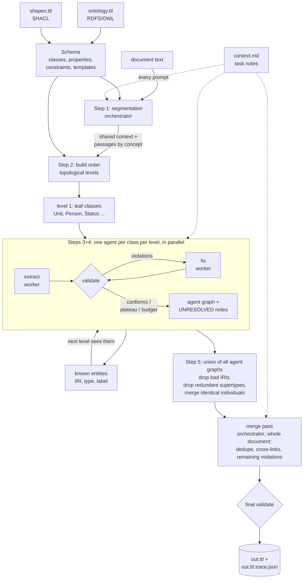
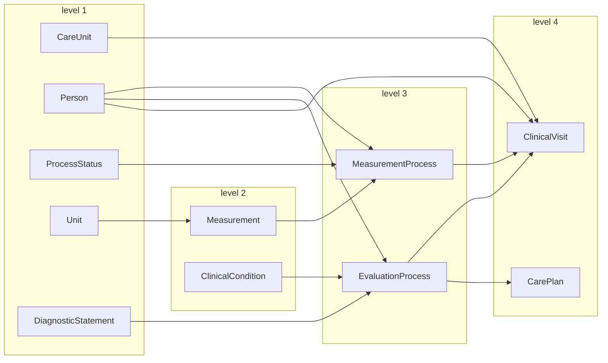
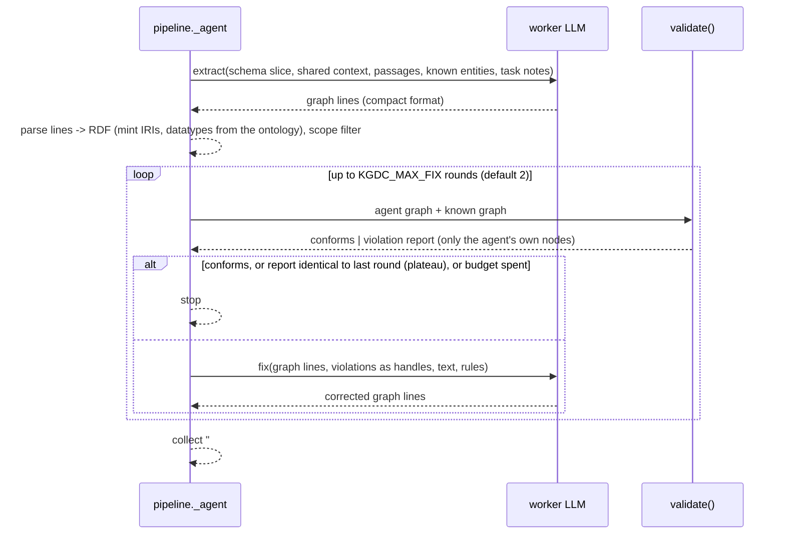
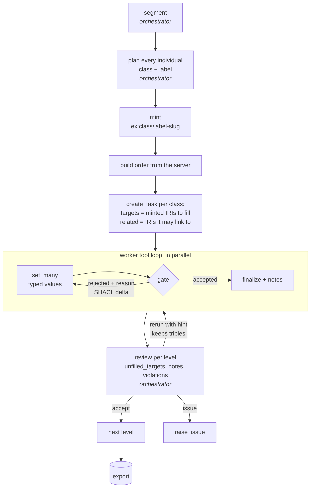

# kgdc: divide-and-conquer knowledge-graph extraction

kgdc turns a text document into an RDF graph that conforms to an ontology (RDFS/OWL) and SHACL shapes
you supply. It does not invent facts. An orchestrator LLM splits the document into passages by ontology
concept. One agent per class then builds that part of the graph, in dependency order, so later classes can
link to entities built earlier. Every agent output is checked against the vocabulary and the SHACL shapes
and repaired. The pieces are joined, and one final pass over the whole document merges duplicates and
adds the links no single agent could see.

Nothing in the prompts is domain-specific. The ontology drives segmentation and build order, the shapes
drive slot filling, and an optional plain-text *context file* carries naming conventions a schema cannot
express. The same code runs on clinical notes, WebNLG DBpedia categories and pharmacology case reports.

**Agents never fabricate.** If a constraint asks for something the text does not state, the agent leaves
the slot empty and writes `# UNRESOLVED: <what> - not stated in the text`. A graph with honest gaps is
preferred over a conformant graph with invented values.

**Model used for every result in this repository:** Gemma 4 26B-A4B-it, a mixture-of-experts model with
26B parameters and about 4B active per token, quantised to 4-bit AWQ and served through LiteLLM under the
name `gemma4-g1` with a 32k-token context. The same model plays both roles (worker and orchestrator).

**Results at a glance** (details in [Evaluation and results](#evaluation-and-results)):

| corpus | docs | metric | kgdc | original pipeline A / B / D (gpt-oss-120b, same scorer) |
|---|---|---|---|---|
| CHR clinical notes, compact format | 200 | identity-hash triple F1, macro / micro | **0.864 / 0.850** | 0.318 / 0.314 / 0.336 (macro) |
| CHR clinical notes, Turtle format | 200 | same | 0.839 / 0.813 | same |
| WebNLG Airport, held-out docs 21-40 | 20 | label triple F1, macro, strict / lenient | 0.866 / 0.957 | - |
| WebNLG Building, held-out docs 21-39 | 19 | same | 0.903 / 0.945 | - |
| ADE corpus, held-out docs 21-40 | 20 | same | 0.610 / 0.759 | - |

Development log: [`docs/lab-notes.md`](docs/lab-notes.md) has numbered findings (1-67) in the order they came
up, with what failed and what fixed it. References like "(notes 45)" below point to items there.

---

## Contents

1. [What it does](#what-it-does)
2. [Install](#install)
3. [Quick start](#quick-start)
4. [How the pipeline works](#how-the-pipeline-works)
5. [Modes](#modes)
6. [The task context file](#the-task-context-file)
7. [Adding a new vocabulary](#adding-a-new-vocabulary)
8. [Configuration reference](#configuration-reference)
9. [Evaluation and results](#evaluation-and-results)
10. [Reproducing the runs](#reproducing-the-runs)
11. [Experimental: tool-gated mode (`--mcp`)](#experimental-tool-gated-mode---mcp)
12. [Tests and CI](#tests-and-ci)
13. [Repository layout](#repository-layout)
14. [Lessons and troubleshooting](#lessons-and-troubleshooting)
15. [Data and licences](#data-and-licences)

---

## What it does

In ordered mode (`--ordered`, the recommended mode) a run has five steps. The CLI prints the same headers
while it runs.

| step | CLI header | who | what |
|---|---|---|---|
| 1 | `Step 1/5 - split the note into passages` | orchestrator | one call returns verbatim passages, each tagged with the ontology concepts it mentions, plus a shared header context |
| 2 | `Step 2/5 - order the classes by their links` | code | classes are sorted into levels so that a class comes after every class it links to |
| 3 | `Steps 3+4 - level k/n: extract and check ...` | one worker per class | the agent writes the individuals of its class from its passages, linking to entities built at earlier levels |
| 4 | (same header) | code + worker | the output is validated (vocabulary, SHACL); the agent gets the violations back and repairs, up to 2 rounds |
| 5 | `Step 5/5 - merge the agent outputs` | code + orchestrator | the agent graphs are joined, identical individuals merged by rule, then one call over the whole document merges duplicates, adds cross-passage links and fixes what it can |

Output: the final graph as Turtle, and a JSON trace with every passage, agent cycle, violation report and
token count.

---

## Install

Python 3.11 or newer.

```bash
git clone <this repository> kgdc && cd kgdc
python -m venv .venv && source .venv/bin/activate
pip install -e ".[dev]"            # rdflib, shacl-rust, openai, python-dotenv (+ pytest)
cp .env.example .env               # then fill in your endpoint, see Configuration reference
```

`uv venv && uv pip install -e ".[dev]"` works the same way.

**Docker.** The image holds only the `kgdc` package and its dependencies (distroless Python 3.11, no
shell, runs as a non-root user, about 162 MB). Its entrypoint is `python3 -m kgdc` and its working
directory is `/work`.

```bash
docker build -t kgdc .                   # or pull ghcr.io/<owner>/<repo>, built by CI on master and v* tags
docker run --rm kgdc --help
```

The `--mcp` mode is not available in the image (the Rust server is not built into it).

---

## Quick start

Configure the endpoint in `.env` (copied from [`.env.example`](.env.example)). The minimum is one
OpenAI-compatible endpoint for both roles:

```bash
LLM_API_KEY=...
LLM_BASE_URL=https://your-endpoint/v1
LLM_MODEL=your-model
# optional: a separate orchestrator endpoint; each unset LLM_BIG_* falls back to LLM_*
# LLM_BIG_MODEL=...
LLM_BIG_MAX_TOKENS=16000           # recommended: endpoints cap output, and a merge writes the whole graph
```

**To reproduce the paper, use one model for both roles.** Set only `LLM_API_KEY`, `LLM_BASE_URL` and
`LLM_MODEL`; every unset `LLM_BIG_*` falls back to them. If your `.env` also sets `LLM_BIG_*` to another
endpoint or model, `python -m kgdc` (and the Docker image) runs the class agents on `LLM_*` and only the
segmentation and merge on `LLM_BIG_*`, so the results are not comparable with the paper's.
[`examples/chr/run_all.sh`](examples/chr/run_all.sh) avoids this by running both roles on `LLM_BIG_*`
unless `KGDC_KEEP_ROLES=1`.

Run one clinical note and score it against its gold graph:

```bash
mkdir -p out
python -m kgdc examples/chr/ontology.ttl examples/chr/shapes.ttl examples/chr/docs/vignette_065.txt \
    --ordered --context examples/chr/context.md -o out/vignette_065.ttl

python examples/chr/score.py out/vignette_065.ttl examples/chr/docs/vignette_065.gold.ttl
```

The same run in Docker, from the repository root. The container reads the `.env` in the mounted folder;
`--env-file .env` does the same explicitly (values are taken literally, so do not quote them). `--user` lets
the container write into your folder. If the endpoint runs on the host's `localhost`, add `--network host`.

```bash
docker run --rm --user "$(id -u):$(id -g)" --env-file .env -v "$PWD:/work" kgdc \
    examples/chr/ontology.ttl examples/chr/shapes.ttl examples/chr/docs/vignette_065.txt \
    --ordered --context examples/chr/context.md -o out/vignette_065.ttl
```

What the run prints on stderr. This is the `vignette_065` run of the Turtle-format batch
(`runs/chr-2026-09-21/`), reconstructed from its trace; timestamps and the per-agent detail lines
(extracting, cycle results, fixing) are left out:

```
== Step 1/5 - split the note into passages ==
segmenting (orchestrator) ...

== Step 2/5 - order the classes by their links ==
build order: [CareUnit, ClinicalCondition, DiagnosticStatement, Measurement, Person] -> [EvaluationProcess, MeasurementProcess] -> [CarePlan, ClinicalVisit]

== Steps 3+4 - level 1/3: extract and check CareUnit, ClinicalCondition, DiagnosticStatement, Measurement, Person ==
  -> CareUnit: 1 entities, 1 check(s), passes
  -> ClinicalCondition: 1 entities, 1 check(s), passes
  -> DiagnosticStatement: 1 entities, 1 check(s), passes
  -> Measurement: 16 entities, 1 check(s), passes
  -> Person: 2 entities, 1 check(s), passes

== Steps 3+4 - level 2/3: extract and check EvaluationProcess, MeasurementProcess ==
  -> EvaluationProcess: 3 entities, 1 check(s), passes
  -> MeasurementProcess: 21 entities, 1 check(s), passes

== Steps 3+4 - level 3/3: extract and check CarePlan, ClinicalVisit ==
  -> CarePlan: 1 entities, 1 check(s), passes
  -> ClinicalVisit: 12 entities, 1 check(s), passes

== Step 5/5 - merge the agent outputs ==

== Final graph ==
190 statements, 35 entities, written to out/vignette_065.ttl
    10  chr:Measurement
    10  chr:MeasurementProcess
     6  chr:Unit
     2  chr:Person
     1  chr:CarePlan
     ...                            (6 more classes with 1 entity each)
passes every SHACL constraint
conforms=True segments=9 llm_calls=11 unresolved=0
  orchestrator   2 calls    11154 in    6521 out  cost n/a  gemma4-g1
  total         11 calls    42129 in   15767 out  cost n/a
  worker         9 calls    30975 in    9246 out  cost n/a  gemma4-g1
```

An agent's entity count includes the individuals it links to (the Measurement agent's 16 are 10
measurements and 6 units). This output scored F1 0.953 against the gold (`runs/chr-2026-09-21/scores.txt`).

The CLI:

```
python -m kgdc ONTOLOGY.ttl SHAPES.ttl TEXT.txt [-o OUT.ttl] [--ordered | --mcp]
                [--context NOTES.md] [--format compact|turtle] [--workers 4] [-q]
```

| flag | meaning |
|---|---|
| `-o OUT.ttl` | write the final Turtle here and the trace to `OUT.ttl.trace.json` (default: Turtle on stdout); the folder must exist |
| `--ordered` | one agent per class per dependency level, later levels reuse earlier entities (**use this**) |
| `--mcp` | tool-gated mode through the Rust MCP server; experimental, see [below](#experimental-tool-gated-mode---mcp) |
| `--context F` | text or markdown file with domain conventions, added to every prompt as TASK NOTES |
| `--format F` | graph text the agents read and write: `compact` (default) or `turtle`; overrides `KGDC_FORMAT` |
| `--shacl E` | SHACL engine: `rust` (default, shacl-rust) or `pyshacl` (needs the `pyshacl` extra); overrides `KGDC_SHACL` |
| `--workers N` | agents run in parallel per level (default 4) |
| `-q`, `--quiet` | no progress output on stderr |

Without `--ordered` or `--mcp` the CLI runs flat mode (see [Modes](#modes)). The exit status is 0 when
the final graph passes every SHACL constraint and 1 otherwise; 1 does not mean the run failed. Unresolved
notes, remaining violations and token use per role are printed on stderr.

From Python:

```python
import kgdc
schema = kgdc.load("examples/chr/ontology.ttl", "examples/chr/shapes.ttl")
result = kgdc.run_ordered(schema, open("doc.txt").read(), workers=4, task=open("context.md").read())
result.ttl, result.conforms, result.violations, result.unresolved, result.segments, result.usage, result.error
```

---

## How the pipeline works

Ordered mode end to end:


```mermaid
flowchart TD
    O[ontology.ttl<br/>RDFS/OWL] --> S[Schema<br/>classes, properties,<br/>constraints, templates]
    H[shapes.ttl<br/>SHACL] --> S
    T[document text] --> SEG
    S --> SEG[Step 1: segmentation<br/><i>orchestrator</i>]
    C[context.md<br/>task notes] -. every prompt .-> SEG
    C -.-> AG
    C -.-> MERGE
    SEG --> |shared context +<br/>passages by concept| BO[Step 2: build order<br/>topological levels]
    S --> BO
    BO --> L0[level 1: leaf classes<br/>Unit, Person, Status ...]
    L0 --> AG
    subgraph AG [Steps 3+4: one agent per class per level, in parallel]
        direction LR
        X[extract<br/><i>worker</i>] --> V{validate}
        V -- violations --> F[fix<br/><i>worker</i>]
        F --> V
        V -- conforms /<br/>plateau / budget --> D[agent graph +<br/>UNRESOLVED notes]
    end
    AG --> K[known entities<br/>IRI, type, label]
    K --> |next level sees them| AG
    AG --> U[Step 5: union of all agent graphs<br/>drop bad IRIs,<br/>drop redundant supertypes,<br/>merge identical individuals]
    U --> MERGE[merge pass<br/><i>orchestrator</i>, whole document:<br/>dedupe, cross-links, remaining violations]
    MERGE --> FV{final validate}
    FV --> OUT[(out.ttl +<br/>out.ttl.trace.json)]
```

Two LLM roles are used. **Workers** (`LLM_*`) extract and fix one class at a time. The **orchestrator**
(`LLM_BIG_*`, falling back to the worker settings) segments and merges: the two calls that need the
whole document. They can be the same model, as in every run reported here.

### 1. Schema: from ontology and shapes to prompt material

`kgdc.schema.load(ontology, shapes)` reads both files with rdflib and builds a `Schema`:

| field | source | used for |
|---|---|---|
| `classes` (qname -> "label - comment (subclass of ...)") | `owl:Class` / `rdfs:Class` | concept list for segmentation, class list for agents |
| `properties` (qname -> "(domain \| ... -> range \| ...): comment") | `rdf:Property`, `owl:*Property` with `rdfs:domain` / `rdfs:range` | property list, templates, build order |
| `constraints` (class -> slot lines) | `sh:NodeShape` with `sh:targetClass` and its `sh:property` shapes | "MUST have 1..n", datatype, class, nodeKind, pattern, message |
| `parents` | `rdfs:subClassOf` | inherited properties, subclass-aware dependencies |
| `terms` | every declared class and property IRI | the closed world for validation |
| `prefixes` | only namespaces actually used, plus `ex:`, `rdf:`, `rdfs:`, `xsd:` | prefix names in prompts |
| `unlinkable` | classes that are never a domain or range, nor a subclass of one | removed from the agents' menu (abstract roots, leftovers) |

Rendering helpers turn this into prompt blocks: `concept_block()` (what exists and how to recognise it),
`property_block()` (domain -> range), `constraint_block()` (what the validator demands) and
`skeleton_block()`, one template per class generated from the vocabulary, with a placeholder typed by the
property's range or the SHACL datatype. The Turtle form of a template:

```turtle
ex:Measurement_1 a chr:Measurement ;
    rdfs:label "..." ;
    chr:hasCode <https://example.org/replace-with-the-real-iri> ;
    chr:hasMeasuredDate "..."^^xsd:dateTime ;
    chr:hasQuantityValue "..."^^xsd:float ;
    chr:hasUnit ex:Unit_1 .
```

`Schema.subset(concepts)` gives an agent only the slice it needs: its classes, their inherited
properties, and the range classes two hops out (Process -> Measurement -> Unit). Validation always uses
the whole vocabulary (`terms` stays complete).

`Schema.dependencies(cls)` is the set of classes an instance may link to (ranges of its inherited
properties **and their subclasses**). `Schema.build_order()` sorts classes into levels with
`graphlib.TopologicalSorter`, so that a class comes after everything it links to. A cycle puts both
classes in the same level.

### 2. Segmentation (orchestrator)

One call (`prompts.segment`) with the concept list and the document returns JSON:

```json
{"shared_context": "<verbatim header facts every segment needs>",
 "segments": [{"id": "s1", "concepts": ["chr:ClinicalVisit", "chr:Person"], "text": "<verbatim span>"}, ...]}
```

Three rules, each learned from a failed run (notes 2, 6, 27):

- spans and shared context are **verbatim**, because a paraphrased span is where facts get invented;
  every span is checked against the document (`verbatim` flag in the trace);
- verbatim spans are **snapped to whole sentences** (`_whole_sentences`), because segmenters drop the
  leading "On <date>, ..." clause that carries exactly what a constraint asks for;
- if the shared context itself describes an instance (the visit, the encounter), it must **also** be a
  segment, otherwise nobody builds it.

`json_call()` tolerates the JSON real models return: code fences, a truncated tail, one malformed element
in a list (skipped, resynced at the next `{`), and one retry with a "JSON only" reminder. If segmentation
is unusable, the whole document becomes one segment.

### 3. Build order

Only the classes the segments mention, plus what they depend on, are built. For the CHR classes a
typical note mentions (the CLI numbers levels from 1):


```mermaid
flowchart LR
    subgraph L0 [level 1]
        CU[CareUnit] ; P[Person] ; PS[ProcessStatus] ; U[Unit] ; DS[DiagnosticStatement]
    end
    subgraph L1 [level 2]
        M[Measurement] ; CC[ClinicalCondition]
    end
    subgraph L2 [level 3]
        MP[MeasurementProcess] ; EP[EvaluationProcess]
    end
    subgraph L3 [level 4]
        CV[ClinicalVisit] ; CP[CarePlan]
    end
    U --> M
    M --> MP
    P --> MP
    PS --> MP
    DS --> EP
    CC --> EP
    P --> EP
    MP --> CV
    EP --> CV
    P --> CV
    CU --> CV
    EP --> CP
```

The levels depend on which classes the note mentions: in the `vignette_065` example above no passage
named Unit or ProcessStatus, so the Measurement and MeasurementProcess agents created those themselves,
and the build had three levels. The full CHR vocabulary sorts into four levels.

Each level runs its agents in parallel (`--workers`). Before a level starts, every individual built so
far is listed as **KNOWN ENTITIES** and passed to the agents, which must link to those instead of
creating new ones. The agent's graph is validated together with the known graph, so a link to a known
individual satisfies `sh:class` constraints.

Agents at the **last level** (the containers: visit, care plan) get the whole document instead of their
own passages, because the links from a container to everything built before are stated all over the
document, not in the container's own sentence (notes 45).

A class with more than `KGDC_MAX_SEGS_PER_AGENT` (12) passages is split over several agents
(`chr:MeasurementProcess#1`, `#2`, ...), so each reply stays under the endpoint's output cap (notes 57).
Containers stay whole.

### 4. Class agents: extract, validate, fix


```mermaid
sequenceDiagram
    participant P as pipeline._agent
    participant W as worker LLM
    participant V as validate()
    P->>W: extract(schema slice, shared context, passages, known entities, task notes)
    W-->>P: graph lines (compact format)
    P-->>P: parse lines -> RDF (mint IRIs, datatypes from the ontology), scope filter
    loop up to KGDC_MAX_FIX rounds (default 2)
        P->>V: agent graph + known graph
        V-->>P: conforms | violation report (only the agent's own nodes)
        alt conforms, or report identical to last round (plateau), or budget spent
            P-->>P: stop
        else
            P->>W: fix(graph lines, violations as handles, text, rules)
            W-->>P: corrected graph lines
        end
    end
    P-->>P: collect "# UNRESOLVED" note lines
```

**Compact format (default)** (`kgdc/compact.py`, notes 63-67). Agents do not write Turtle. They write one
line per individual:

```
<handle> <Class> "<label>" <property>=<value>; <property>=<value>; ...
m1 Measurement "Body Height" hasCode=<https://loinc.org/8302-2>; hasMeasuredDate=2016-10-04T05:20:29+02:00; hasQuantityValue=104; hasUnit=k3
# UNRESOLVED: <what> - not stated in the text
```

Handles (`m1`) are the model's own names. Known entities from earlier levels are listed as `k3 Unit "cm"`
and linked by handle. The pipeline:

- mints every IRI from the node's content, so the same node written by two agents gets the same IRI;
- types every literal from the property's range or the SHACL datatype;
- parses line by line: a line it cannot use (unreadable, a link to an undeclared handle, an invalid IRI,
  a malformed class or property name) goes back to the agent as a violation and is never dropped
  silently, and a cut-off reply loses only its last line;
- treats a handle declared again with another class or label as a new individual, links it to the
  nearest earlier declaration and tells the agent (notes 67);
- reads a repair reply on its own, so a repaired line that reuses a handle does not merge into the old
  node (notes 67).

After parsing, the graph is plain RDF and follows the same path as a Turtle reply.

The extract prompt (`prompts.extract_compact`) contains, in order: the scope ("write only individuals of
class X plus what they link to"), the format, classes and properties by name with the ontology's
descriptions, the SHACL constraints, one template line per class (classes built at an earlier level get
no line, and a slot pointing at one reads `<KNOWN ENTITY handle>`), four rules (one individual per thing,
with class and label; values copied exactly; terminology codes as IRIs; never fabricate), the task notes,
the known entities, the shared context and the passages. The fix prompt lists one line per violation, with
IRIs shown as handles, and the agent's own nodes as lines.

**Turtle format** (`--format turtle` or `KGDC_FORMAT=turtle`, the default before notes 66). The agent
writes Turtle with prefixed names. Namespace IRIs never appear in a prompt: the pipeline strips any
`@prefix` line a model writes and prepends the canonical block (notes 60). The extract prompt
(`prompts.extract`) carries Turtle templates and seven rules, three of them about syntax (minting IRIs
from the text, datatypes, angle brackets for IRI slots). Its weakness on large documents: a reply that is
not valid Turtle contributes nothing. In the ablation, 10 of 13 such replies were an UNRESOLVED note
written after a `;`, which leaves the statement open.

In both formats the fix prompt says that **formatting** violations are always fixable (the value is
already there, only its form is wrong) and that **missing facts** are not: keep the graph and add an
UNRESOLVED note. The loop stops at conformance, when the violation report repeats (the agent is honestly
stuck), or when the budget is spent.

**Scope** (`scope_filter`, every level, notes 58, 61, 65). An agent keeps to its slice of the vocabulary.
These are dropped: a new individual whose class an earlier level built (it should link to the known
one), a new individual none of whose classes is in the slice, and a statement with a declared property
outside the slice. The repair prompt then says what was removed and which known entity to link instead.
Fix outputs go through the same filter. Validation runs on the agent's graph plus the known graph, but
the agent sees only violations on its own nodes (notes 64).

An exception from the LLM (context window, dead endpoint) ends **that agent** with a note and an `error`
field in the trace; the document still gets a graph from the other agents (notes 46). The SHACL report in
a fix prompt is capped (`KGDC_MERGE_MAX_CHARS`), because a verbose pySHACL report once overflowed a 32k
context.

Optional per-segment **verifier** (`KGDC_VERIFY=1`): one extra worker call that numbers the agent's
triples and asks which ones the text does not support (dropped by index, so it can only remove) and which
stated facts are missing (passed on to the merge). On `vignette_065` it lowered F1 from 0.953 to 0.854 and
added 12 calls (notes 39); off by default.

### 5. Validation

`validate.validate(ttl, schema)` runs three checks and renders every problem in pySHACL's "Constraint
Violation" block format, so the fix prompt sees one consistent report:

1. **Turtle parse.** A syntax error is reported with the offending line and a hint (every statement
   starts with a subject IRI; local names use letters, digits, `_`, `-`).
2. **Closed-world vocabulary** (`vocabulary_violations`): every predicate must be a declared property (or
   `rdf:type`, `rdfs:label`, `rdfs:comment`), every `rdf:type` object a declared class, and no IRI may
   contain characters that are illegal in an IRI (`_BAD_IRI`: whitespace, ``<>"{}|\^` ``, a bare `%`).
   rdflib accepts such IRIs, but OWL tools downstream silently truncate around them and SHACL validators
   refuse the file, so they are rejected here (notes 10).
3. **SHACL** with [shacl-rust](https://pypi.org/project/shacl-rust/), with the ontology appended to the
   data graph (so `sh:class` sees subclass axioms), SPARQL targets on, warnings and infos ignored. Its
   results are rendered in pySHACL's text-report format. `--shacl pyshacl` (or `KGDC_SHACL=pyshacl`,
   after `pip install -e ".[pyshacl]"`) runs pySHACL instead, with the ontology as `ont_graph` and
   `advanced=True`; the results reported in this README were produced with pySHACL.

### 6. Union, cleanup and the merge pass

- **Union** (`_union`): every parseable agent graph goes into one rdflib graph. Unparseable outputs are
  kept as text for the merge pass, so facts do not vanish silently. Triples with illegal IRIs are dropped
  because rdflib can parse but not serialise them.
- **Redundant supertypes** (`drop_redundant_types`): `x a MeasurementProcess, MedicalProcedure` becomes
  `x a MeasurementProcess`. Models add the range class next to the real one; it is entailed anyway and
  re-keys the node under identity-hash scoring (notes 45).
- **Identical individuals** (`merge_identical`): two nodes with the same types and the same non-label
  statements (or, with none, the same labels) become one. Links move to the copy others already point at,
  every label is kept, and literals compare by value. It repeats until nothing changes, so two merged
  Units make their Measurements identical in the next round. Chunk agents re-create each other's nodes;
  merging them by rule costs no LLM call and shrinks the merge prompt (notes 62).
- **Dangling links** (`drop_dangling`): links to individuals the graph never declares are dropped, after
  the union and again after the merge (notes 64).
- **Merge pass** (`_final`, orchestrator): gets the whole document, the union graph, the remaining
  violations (capped), the UNRESOLVED notes and any unparsed agent text. It merges duplicates, adds
  cross-passage links the document states, removes what the document does not support and resolves
  violations where it can. The merge reads and writes Turtle in both formats. If the call fails (context
  window, timeout), or the reply does not parse, or it holds less than `KGDC_MERGE_MIN_KEEP` (0.5) of the
  union's triples (a reply cut off by the output cap), the union is returned and `error` is set. The
  result is cleaned again and validated.
- `KGDC_MERGE=edits` replaces the rewrite with an edit list (links and same-as pairs between existing
  nodes, each edit validated on its own). It avoids failed merges but loses recall, because it cannot add
  individuals the agents missed (notes 64); off by default.

**Known limit.** On the longest notes the merge prompt does not fit the 32k context of the deployment used
here, and the document keeps the un-merged union. This happened on 84 of the 200 CHR notes in the compact
run (notes 67). [`examples/chr/remerge.py`](examples/chr/remerge.py) re-runs only this step from the saved
traces on an endpoint with a larger context; see [Reproducing the runs](#reproducing-the-runs).

### 7. Outputs and trace

`-o out.ttl` writes the final graph; `out.ttl.trace.json` holds the full provenance:

```json
{"ttl": "...", "conforms": true, "violations": "", "unresolved": [],
 "segments": [{"id": "chr:Measurement", "level": 1, "concepts": ["chr:Measurement"], "text": "...",
               "cycles": [{"cycle": 0, "conforms": false, "violations": "..."}, {"cycle": 1, "conforms": true, "violations": ""}],
               "ttl": "...", "unresolved": [], "llm_calls": 2, "shared_context": "...", "build_order": [["chr:Unit", ...], ...]}],
 "llm_calls": 11, "usage": {"worker": {"calls": 9, "prompt_tokens": 28256, "completion_tokens": 5716, "cost": null, "model": "..."},
                            "orchestrator": {...}, "total": {...}}, "error": null}
```

Each entry of `segments` is one agent (not one passage). `level` in the trace counts from 0.

---

## Modes

| mode | flag | what differs | when |
|---|---|---|---|
| flat | (none) | one agent per **passage**, all in parallel, then merge | small documents, a quick look |
| ordered | `--ordered` | one agent per **class** per dependency level; later levels see earlier entities; the last level sees the whole document | **the default choice**: every result above; 11-40 LLM calls per note in the compact CHR run (median 21) |
| tool-gated | `--mcp` | **experimental**; see [below](#experimental-tool-gated-mode---mcp) | research on small worker models |

The step headers are printed in ordered mode. Flat mode prints only step 1 and the final block.

---

## The task context file

What the schema cannot say goes into a plain text or markdown file passed with `--context`. It is added
to every prompt as **TASK NOTES** under a standing rule: notes explain how to *encode* stated facts and
never add facts. This was the most effective single change in the project: on `vignette_065`, F1 went
from 0.36 to 0.87-0.95 with the same architecture (notes 1). Typical content, from
[`examples/chr/context.md`](examples/chr/context.md):

- where a terminology code goes and in which IRI form (`(LOINC: 8302-2)` -> `chr:hasCode <https://loinc.org/8302-2>` on the Measurement);
- how a unit symbol is encoded (`kg/m2` -> `.../ucum/kgperm2`);
- which sentence pattern maps to which properties ("a <name> measurement was performed on <patient>" -> process with patient, date, result);
- who counts as the performer; that the visit links every process of the encounter;
- what **not** to create ("a care plan that refers to follow-up monitoring" names no procedure).

For WebNLG and ADE the same file carries naming granularity ("City, State" is one place; every sign and
symptom is its own adverse effect; a drug with several surface forms is one node with one label per form).
Each of these lines came from reading the misses of one run, and each moved macro F1 by 0.05 to 0.25
(notes 42, 52).

---

## Adding a new vocabulary

Three files, no code:

1. **`ontology.ttl`**: classes with `rdfs:label` and `rdfs:comment` (the comment is how the segmenter
   recognises the concept in text), properties with `rdfs:domain` and `rdfs:range` (several domains are
   fine). Datatype properties need an `xsd:` range. If you score by label, keep property local names
   equal to the ones your gold uses.
2. **`shapes.ttl`**: one `sh:NodeShape` per class with `sh:targetClass`; property shapes with
   `sh:minCount` (rendered as MUST), `sh:datatype`, `sh:class`, `sh:nodeKind`, `sh:pattern` and
   `sh:message`. At minimum require `rdfs:label` on every class: scoring and the known-entities block rely
   on the label.
3. **`context.md`** (optional): the conventions described above.

Then check the schema before spending LLM calls:

```bash
python -c "import kgdc; s = kgdc.load('ontology.ttl', 'shapes.ttl'); print(sorted(s.classes)); print(s.build_order()); print(s.unlinkable)"
python -m kgdc ontology.ttl shapes.ttl doc.txt --ordered --context context.md -o out/doc.ttl
```

A class that no property reaches shows up in `unlinkable` and is left out of the agents' menu on purpose.

Worked examples in the repository:

| example | domain | classes / properties | documents | preparation |
|---|---|---|---|---|
| [`examples/chr/`](examples/chr/) | clinical notes (Synthea-derived) | 19 / 24 (+8 unlinkable) | 200 + gold graphs | copied from the thesis corpus |
| [`examples/webnlg-airport/`](examples/webnlg-airport/) | DBpedia airports | 7 / 16 | 40 + gold triples | `examples/webnlg/prepare.py Airport examples/webnlg-airport/docs` |
| [`examples/webnlg-building/`](examples/webnlg-building/) | DBpedia buildings | 6 / 11 | 39 + gold triples | `examples/webnlg/prepare.py Building examples/webnlg-building/docs` |
| [`examples/ade/`](examples/ade/) | drug -> adverse effect, case reports | 2 / 2 | 40 + gold pairs | `examples/ade/prepare.py examples/ade/docs` |

For WebNLG and ADE, documents 1-20 are the development set and 21-40 the held-out set.

---

## Configuration reference

All settings are environment variables. `.env` is loaded with python-dotenv when `kgdc.llm` is imported.
Two details matter:

- `.env` is looked up in the directory you run `kgdc` from, then in its parents. In Docker that is the
  mounted `/work` folder, so a `.env` there is found; `docker run --env-file .env` works too.
- A variable already set in the environment wins over `.env`, and `unset` does not help, because
  `load_dotenv` adds it back. Export an empty string to switch one off (notes 40).

**Endpoints** (each `LLM_BIG_*` setting falls back to its `LLM_*` counterpart unless noted):

| variable | default | meaning |
|---|---|---|
| `LLM_API_KEY`, `LLM_BASE_URL`, `LLM_MODEL` | required | worker endpoint (OpenAI-compatible) |
| `LLM_BIG_API_KEY`, `LLM_BIG_BASE_URL`, `LLM_BIG_MODEL` | `LLM_*` | orchestrator endpoint (segmentation, merge, MCP planning and review) |
| `LLM_TIMEOUT` | 90 | seconds per worker request; retryable errors are retried 5 times with a 10 s × attempt back-off |
| `LLM_BIG_TIMEOUT` | 600 | seconds per orchestrator request (does not fall back to `LLM_TIMEOUT`) |
| `LLM_BIG_MAX_TOKENS` | unset | output budget for orchestrator calls; set it (e.g. 16000), or endpoints cut off a big merge |
| `LLM_MAX_TOKENS` | unset | cap on worker completions in the `--mcp` tool loop only |
| `LLM_PROVIDER_SORT`, `LLM_BIG_PROVIDER_SORT` | unset | OpenRouter only: e.g. `throughput` routes to the fastest provider |
| `LLM_BASIC_AUTH`, `LLM_BIG_BASIC_AUTH` | unset | `user:password` for an endpoint behind HTTP basic auth |
| `LLM_COST_PER_MTOK`, `LLM_BIG_COST_PER_MTOK` | unset | `<in>,<out>` USD per 1M tokens when the endpoint reports no cost (the BIG one does not fall back) |

**Pipeline:**

| variable | default | meaning |
|---|---|---|
| `KGDC_FORMAT` | `compact` | graph text agents read and write: `compact` or `turtle`; `--format` overrides it |
| `KGDC_SHACL` | `rust` | SHACL engine: `rust` (shacl-rust) or `pyshacl`; `--shacl` overrides it |
| `KGDC_MAX_FIX` | 2 | validator-guided fix rounds per agent |
| `KGDC_MAX_SEGS_PER_AGENT` | 12 | passages per agent before a class is split over several agents |
| `KGDC_MERGE` | `rewrite` | `edits`: the merge returns links and same-as pairs instead of the whole graph |
| `KGDC_MERGE_EDIT_MAX_TOKENS` | 3000 | output budget of the edit-list merge |
| `KGDC_MERGE_MAX_CHARS` | 12000 | cap per section of the merge prompt, and for the SHACL report in fix prompts |
| `KGDC_MERGE_MIN_KEEP` | 0.5 | a merge reply with fewer triples than this fraction of the union counts as cut off; the union is kept |
| `KGDC_VERIFY` | 0 | `1` enables the per-segment verifier pass |
| `KGDC_PROMPT_SHACL` | 1 | `0` drops the SHACL block from the extraction prompt, keeping only required slots and IRI patterns (ablation) |
| `KGDC_PROMPT_NOFAB` | 1 | `0` drops the no-fabrication / UNRESOLVED rule (costs precision; ablation only) |
| `KGDC_CONTEXT_FILTER` | 0 | `1` gives each agent only the task-note bullets that name its classes or no class at all |
| `KGDC_SALVAGE` | 0 | `1` keeps the statements of an unparseable Turtle reply that parse on their own |

**`--mcp` mode only:**

| variable | default | meaning |
|---|---|---|
| `KGDC_AGENT_TURNS` | 40 | tool-loop turns per task |
| `KGDC_MAX_RERUNS` | 1 | reruns per task the orchestrator may request |
| `KGDC_TOOL_MODE` | `native` | `text` for endpoints without a tool-call parser (switches automatically on the 400 error) |
| `KGDC_TOOL_CHOICE` | `required` | `tool_choice` sent with native tool calling |

**Example scripts only:**

| variable | used by | meaning |
|---|---|---|
| `KGDC_KEEP_ROLES` | `examples/chr/run_all.sh` | by default the script runs both roles on the `LLM_BIG_*` endpoint; `1` keeps separate worker settings |
| `THESIS_DIR` | `examples/chr/thesis_eval.sh` | path to the companion Thesis repository (default `$HOME/workspace/03_ids/Thesis`) |
| `PYTHON` | `examples/chr/thesis_eval.sh` | Python used for the Thesis evaluator (default `python3`) |

`run_all.sh` also sets `LLM_TIMEOUT=600` and `LLM_BIG_MAX_TOKENS=16000` unless they are set, and
`remerge.py` sets `LLM_BIG_MAX_TOKENS=16000` unless it is set.

---

## Evaluation and results

### How the numbers are computed

Every corpus in the repository ships gold data, and every number is a triple-level precision, recall and
F1 against that gold.

**Node alignment.** Extracted graphs use IRIs of the model's own making, so triples cannot be compared
verbatim. Two alignments are used:

- *Identity-hash* ([`examples/chr/score.py`](examples/chr/score.py), vendoring the Thesis scorer
  `canonical_iri.py`): every node is renamed to a hash of its class-specific identity slots (a
  Measurement is its code, value and date; a Person its label; a process its date and result; a visit
  its patient and date), computed bottom-up so that linked nodes inherit their neighbours' identity. Two
  graphs describing the same things then share IRIs, and the triple sets are compared directly. It is
  deterministic, with no matching heuristics; one wrong identity slot re-keys the node and every triple
  on it.
- *Label-level* ([`examples/webnlg/score.py`](examples/webnlg/score.py)): every node is replaced by its
  normalised `rdfs:label` (accents, underscores, dashes, punctuation and articles folded; parseable dates
  to ISO), and `(subject label, property local name, object label or literal)` sets are compared with the
  gold `"s | p | o"` strings. Used for WebNLG and ADE, whose gold comes as labelled triples.

**Gold-versus-text artefacts.** Some mismatches are conventions of the gold, not extraction errors, and
they can dominate an exact score. The CHR scorer strips honorifics from labels (the gold says "Ms. X", the
text says "X"; without this the patient and the visit re-key and vignette_001 drops from 0.93 to 0.67) and
removes redundant supertypes. `--exact` turns both off. The label scorer's `--lenient` mode treats a node
as all of its labels (aliases such as "MTX" and "methotrexate") and matches arguments by containment, one
to one ("hives" against "occasional hives"). It is the fair mode for span-level gold such as ADE, which
annotates the same fact once per mention.

**Failed outputs** score 0 and are not dropped ([`examples/chr/compare.py`](examples/chr/compare.py)).

**Development versus held-out documents.** No gold reaches the pipeline: the CLI reads the ontology, the
shapes, the text and the context file, and nothing in the `kgdc` package references gold. But the context
files and a few prompt rules were written by reading the misses on scored documents (vignettes 065 and
001-010 for CHR; documents 1-20 of each WebNLG category and of ADE). Those documents are *development*
data and their scores are optimistic. For WebNLG and ADE, documents 21-40 were run once after all tuning
and are reported as held-out. For CHR the tables are also given without the 11 development notes.

**Aggregates.** *Micro* pools triples over the corpus (large documents weigh more); *macro* averages the
per-document F1. Paired comparisons report per-document ΔF1, wins/ties/losses and an exact two-sided sign
test.

**Baselines.** The original pipeline from the companion Thesis repository, with **gpt-oss-120b** as the
extractor, has three systems: **A**, one extraction call per document; **B**, A plus up to three
SHACL-feedback repair calls; **D**, A repeated four times without feedback (a compute-matched control).
Their committed outputs for all 200 notes were rescored with the same identity-hash scorer as kgdc
(`runs/chr-2026-09-21/old_{a,b,d}.txt`). This compares *pipeline + model* with *pipeline + model*.

### CHR clinical notes: two 200-note runs

Both runs: all 200 notes, ordered mode, the model above for both roles, 4 notes in parallel.

| system | micro P | micro R | micro F1 | macro P | macro R | macro F1 | docs F1 ≥ 0.9 | docs F1 < 0.5 |
|---|---|---|---|---|---|---|---|---|
| **kgdc, compact format** (25 Sep) | 0.845 | 0.856 | **0.850** | 0.847 | 0.885 | **0.864** | 77 | 0 |
| kgdc, Turtle format (21 Sep) | 0.767 | 0.865 | 0.813 | 0.796 | 0.888 | 0.839 | 58 | 0 |
| A (gpt-oss-120b, 1 call) | 0.387 | 0.268 | 0.317 | 0.374 | 0.277 | 0.318 | 0 | 188 |
| B (SHACL loop, up to 4 calls) | 0.382 | 0.268 | 0.315 | 0.368 | 0.275 | 0.314 | 0 | 190 |
| D (4 calls, no feedback) | 0.402 | 0.277 | 0.328 | 0.396 | 0.293 | 0.336 | 0 | 187 |

Sources: [`results/2026-09-25/chr_compact_comparison.txt`](results/2026-09-25/chr_compact_comparison.txt),
[`results/2026-09-21/chr_comparison_final.txt`](results/2026-09-21/chr_comparison_final.txt).

| paired, per document | compact vs A | compact vs B | compact vs D | Turtle vs A | Turtle vs B | Turtle vs D |
|---|---|---|---|---|---|---|
| mean ΔF1 | +0.546 | +0.550 | +0.528 | +0.521 | +0.525 | +0.503 |
| wins / ties / losses | 200/0/0 | 200/0/0 | 200/0/0 | 200/0/0 | 200/0/0 | 200/0/0 |
| sign test p | 1.2e-60 | 1.2e-60 | 1.2e-60 | 1.2e-60 | 1.2e-60 | 1.2e-60 |

**Compact run (25 Sep, notes 67).** Without the 11 development notes: macro 0.865 / micro 0.849 on 189
([`chr_compact_comparison_no_dev.txt`](results/2026-09-25/chr_compact_comparison_no_dev.txt)). Per-document
F1 quartiles 0.83 / 0.87 / 0.91, minimum 0.61. Against the Turtle run it is better on 117 notes and worse on
58, mean +0.026; the gain is in precision. 4,364 LLM calls, 15.6M prompt and 4.6M output tokens, 5.8 min per
note, no unparsed agent replies ([`chr_compact_summary.md`](results/2026-09-25/chr_compact_summary.md),
per note: [`chr_compact_results.csv`](results/2026-09-25/chr_compact_results.csv)). 74 notes end with
SHACL violations left (exit status 1). The merge step failed on 86 notes (`merge_error` in the CSV); notes
67 attributes 84 of them to the merge prompt exceeding the 32k context. Those notes keep the un-merged union.
Output graphs and traces: [`runs/chr-compact-2026-09-25/D/`](runs/chr-compact-2026-09-25/D/). Recomputed from
them: 198 of 200 graphs use only declared classes and properties, 126 pass every SHACL constraint, and
without `rdfs:label` statements macro F1 is 0.898 (micro 0.881).

**Turtle run (21 Sep).** Without the 11 development notes: macro 0.836 / micro 0.811 on 189 (A 0.315,
B 0.310, D 0.330 macro; [`chr_comparison_final_no_dev.txt`](results/2026-09-21/chr_comparison_final_no_dev.txt)).
Quartiles 0.79 / 0.85 / 0.91 (min 0.53, max 0.95). This run predates the corrections of notes 62-66. It
went through three passes on the same code line: pass 1 ran all 200 with a 90 s worker timeout, which cost
22 large notes their MeasurementProcess agent (now 600 s in `run_all.sh`), and 43 merge replies were cut off
by the endpoint's output cap and written as results (now the union is kept; `LLM_BIG_MAX_TOKENS`). Pass 2
re-ran 36 notes after the scope filter was added; pass 3 re-ran 15 after its level-0 bug was fixed and
large classes were split over several agents. Afterwards 15 outputs still carried a namespace an agent had
mistyped by one character; they were rewritten to the canonical namespace, which is what the code now
emits (notes 60). The outputs of the final state and their traces are in
[`runs/chr-2026-09-21/`](runs/chr-2026-09-21/); the replaced intermediate files are in git history. 54 of
the 200 traces record a failed merge (36 of them a context-window error).

Applying the identical-individual merge (notes 62) offline to the Turtle outputs raises them to macro 0.844 /
micro 0.822 ([`chr_kgdc_final_merge_identical_scores.txt`](results/2026-09-21/chr_kgdc_final_merge_identical_scores.txt));
the files in `runs/` are not rewritten.

**Cross-check with the Thesis evaluator.** [`examples/chr/thesis_eval.sh`](examples/chr/thesis_eval.sh)
copies a kgdc run next to systems A and B in the Thesis repository and runs its own `pipeline/evaluate.py`
in both alignment modes. On the Turtle run (all 200, macro F1): normalizer alignment kgdc 0.779, A 0.528,
B 0.523 (the thesis's published numbers for A and B); identity-hash without label normalisation kgdc
0.696, A 0.289, B 0.285 ([`results/2026-09-21/chr_thesis_evaluator_*.json`](results/2026-09-21/)). The
ranking does not depend on the scorer.

**Re-merge.** [`examples/chr/remerge.py`](examples/chr/remerge.py) re-runs only the final merge for the notes
whose merge failed, from their traces, on an endpoint with a larger context (the same model, served with a
256k-token context). Outputs: [`runs/chr-2026-09-21-remerge/`](runs/chr-2026-09-21-remerge/) and
[`runs/chr-compact-2026-09-25-remerge/`](runs/chr-compact-2026-09-25-remerge/); each note's trace has a
`remerge` entry (status, error, tokens) and rejected replies are kept as `<note>.merge_reply.txt`.

| run | notes re-merged | merge accepted | macro F1 | micro F1 | P | R | F1 >= 0.9 |
|---|---|---|---|---|---|---|---|
| Turtle, 21 Sep (before → after) | 54 | 50 | 0.839 → 0.852 | 0.813 → 0.838 | 0.816 | 0.861 | 58 → 66 |
| compact, 25 Sep (before → after) | 86 | 78 | 0.864 → 0.874 | 0.850 → 0.868 | 0.862 | 0.875 | 77 → 98 |

A merge costs about 21k prompt and 16k output tokens. On a few long notes the model leaves out part of the
graph when merging (16 accepted merges kept less than 70 % of the union's statements, and 14 of them lowered
F1): rejecting merges that keep less than 80 % of the union would raise compact macro F1 to 0.884, a
threshold chosen after looking at these results. Runs of the re-merge exposed three parser problems, now
fixed for every Turtle reply: an echoed `PREFIXES:` line, other echoed prompt labels (`Allowed classes: …`),
and a statement left open by a `# UNRESOLVED` comment. `remerge.py` options: `REMERGE_WALL_SECONDS` (hard
limit per merge call, default 600), `REMERGE_SKIP_TIMEOUTS=1` (leave notes that hung for a later pass);
`LLM_BIG_PROVIDER_IGNORE` (OpenRouter providers to skip).

### Graph format: compact lines versus Turtle

Same 30 CHR notes (spread over the size range), same model, same code; only `KGDC_FORMAT` differs
([`examples/chr/ablation.py`](examples/chr/ablation.py),
[`runs/ablation-2026-09-24-fix2/`](runs/ablation-2026-09-24-fix2/), notes 63-66):

| | Turtle (A) | compact (D, default) |
|---|---|---|
| macro / micro F1 | 0.834 / 0.789 | **0.859 / 0.834** |
| macro F1, 15 smaller / 15 larger notes | 0.910 / 0.758 | 0.908 / **0.809** |
| agent replies that were not valid output | 13 | 0 |
| LLM calls / repair calls | 560 / 103 | 637 / 169 |
| prompt / output tokens | 100 % / 100 % | 81 % / 77 % |
| minutes per note | 8.3 | 6.1 |

The formats are equal on the smaller notes. On the larger ones Turtle loses whole agent replies to syntax
errors. The compact format needs more repair calls (it also repairs lines the parser could not use) but
fewer tokens and less time. When reading older numbers, keep two things apart: pipeline corrections made
during the ablation (notes 62-65) raised the Turtle pipeline from 0.769 to 0.834 on these notes, and only
the remaining 0.025 macro / 0.044 micro is the format. Three compact runs on the same notes ranged
0.859-0.865 macro.

Other switches measured on the same notes, before those corrections (notes 63): dropping the SHACL block
from the prompt was harmless with Turtle (0.787 vs 0.769); dropping the no-fabrication rule cost precision
in every combination; the edit-list merge removed failed merges but lost recall.

### WebNLG and ADE

All with the same model, ordered mode and Turtle output (before the compact format existed). Score files
are in [`results/2026-09-21/`](results/2026-09-21/) (development) and
[`results/2026-09-21/heldout/`](results/2026-09-21/heldout/).

| corpus | docs | strict micro P / R / F1 | strict macro F1 (perfect docs) | lenient micro F1 | lenient macro F1 (perfect docs) |
|---|---|---|---|---|---|
| WebNLG Airport, development 1-20 | 20 | 0.904 / 0.979 / 0.940 | 0.948 (12) | - | - |
| WebNLG Building, development 1-20 | 20 | 0.848 / 0.839 / 0.843 | 0.828 (9) | - | - |
| ADE, development 1-20 | 20 | 0.523 / 0.523 / 0.523 | 0.576 (2) | 0.795 | 0.786 (6) |
| WebNLG Airport, **held-out** 21-40 | 20 | 0.821 / 0.908 / 0.863 | 0.866 (12) | 0.950 | 0.957 (17) |
| WebNLG Building, **held-out** 21-39 | 19 | 0.901 / 0.883 / 0.892 | 0.903 (10) | 0.941 | 0.945 (12) |
| ADE, **held-out** 21-40 | 20 | 0.729 / 0.495 / 0.590 | 0.610 (5) | 0.717 | 0.759 (7) |

These figures are recomputed from the per-document lines in the score files. The lab notes (42) give
0.854 / 0.838 for WebNLG Building development, which does not match the committed score file (TODO:
check which run the file holds).

Held-out and development scores are close for all three corpora (strict macro: Airport 0.87 vs 0.95,
Building 0.90 vs 0.83, ADE 0.61 vs 0.58), so the context-file conventions transfer rather than memorise.

Remaining misses across corpora: facts the text supports but the gold omits, entity-granularity
conventions of the gold (one "City, State" place; DBpedia entity names for what the text paraphrases;
span boundaries and per-mention aliases in ADE), and two text-versus-gold inconsistencies in the CHR
corpus generator. Real extraction errors were rare with this model.

### Single-note checks

| setting | metric | result | source |
|---|---|---|---|
| CHR vignette_065, ordered, Turtle | identity-hash F1 | 0.953 (recall 1.0; the only false positives are gold conventions) | `runs/chr-2026-09-21/scores.txt`, notes 36 |
| same, compact run | identity-hash F1 | 0.926 | `results/2026-09-25/chr_compact_scores.txt` |
| same, `KGDC_VERIFY=1` | identity-hash F1 | 0.854, +12 calls | notes 39 |
| same, `--mcp` | identity-hash F1 | 0.37 and 0.24 in two runs | notes 36 |

---

## Reproducing the runs

The batch scripts call a real LLM endpoint for every note and cost what that endpoint costs. A full CHR
run is about 4,400 calls (compact run: 15.6M prompt and 4.6M output tokens).

```bash
# all 200 CHR notes, 4 in parallel, resumable (skips notes whose .ttl exists), then scored
examples/chr/run_all.sh runs/chr-YYYY-MM-DD 4
python examples/chr/summary.py runs/chr-YYYY-MM-DD    # micro/macro F1, quartiles, size buckets, worst notes
cp runs/chr-2026-09-21/old_{a,b,d}.txt runs/chr-YYYY-MM-DD/
python examples/chr/compare.py runs/chr-YYYY-MM-DD    # paired comparison with A, B, D
python examples/chr/compare.py runs/chr-YYYY-MM-DD --exclude vignette_065,vignette_001,vignette_002,vignette_003,vignette_004,vignette_005,vignette_006,vignette_007,vignette_008,vignette_009,vignette_010

# one note, one score
python examples/chr/score.py OUT.ttl examples/chr/docs/vignette_NNN.gold.ttl [--exact]

# format / prompt ablation on 30 notes (variants A-G, see the script)
python -u examples/chr/ablation.py runs/ablation-YYYY-MM-DD --docs 30 --parallel 4 --variants A,D

# re-run only the failed merges of a run, from its traces, on a larger-context orchestrator
python examples/chr/remerge.py runs/chr-YYYY-MM-DD runs/chr-YYYY-MM-DD-remerge --dry-run   # prompt sizes, no LLM call
LLM_BIG_BASE_URL=... LLM_BIG_MODEL=... python examples/chr/remerge.py runs/chr-YYYY-MM-DD runs/chr-YYYY-MM-DD-remerge

# older outputs only: replace cut-off merge replies by the union rebuilt from the trace (no LLM call)
python examples/chr/repair_truncated.py RUN_DIR

# cross-check with the Thesis evaluator (needs the companion Thesis repository, THESIS_DIR)
examples/chr/thesis_eval.sh RUN_DIR
```

Notes on the scripts:

- `run_all.sh` expects a virtualenv at `.venv/` and a `.env` in the repository root, and by default runs
  both roles on the `LLM_BIG_*` endpoint (`KGDC_KEEP_ROLES=1` to keep them apart). It writes
  `<note>.ttl`, `<note>.ttl.trace.json`, `<note>.log` and `scores.txt` into the run folder.
- `remerge.py` does not re-run the agents. It rebuilds the union from the agent graphs in each trace,
  exactly as `run_ordered` does, and calls the same merge function. Variables exported in the shell
  override `.env`. The merge prompts reach about 28k tokens plus the merged graph as output, so use an
  endpoint with at least 64k context. The output folder gets `<note>.ttl`, the original trace with a
  `remerge` entry, and `scores.txt`; the run folder is not modified.
- WebNLG and ADE have no batch script: run `python -m kgdc` per document with the example's ontology,
  shapes and `--context`, then `python examples/webnlg/score.py OUT.ttl GOLD.json [--lenient]` (the ADE
  gold uses the same JSON shape).

---

## Experimental: tool-gated mode (`--mcp`)

> **Experimental.** This mode is kept for research on small worker models. With the same Gemma 4
> 26B-A4B model it scored far below ordered mode and varied a lot between runs on `vignette_065`
> (0.37 and 0.24 against 0.953; notes 36). Do not use it for results.

The orchestrator plans and mints every individual up front; workers fill slots with typed `set_many`
calls through a gate; the server measures coverage.


```mermaid
flowchart TD
    SEG[segment<br/><i>orchestrator</i>] --> PLAN[plan every individual<br/>class + label<br/><i>orchestrator</i>]
    PLAN --> MINT[mint<br/>ex:class/label-slug]
    MINT --> LV[build order from the server]
    LV --> TASK[create_task per class:<br/>targets = minted IRIs to fill<br/>related = IRIs it may link to]
    TASK --> W
    subgraph W [worker tool loop, in parallel]
        direction LR
        S1[set_many<br/>typed values] --> G{gate}
        G -- rejected + reason<br/>SHACL delta --> S1
        G -- accepted --> FIN[finalize + notes]
    end
    W --> REV[review per level<br/>unfilled_targets, notes, violations<br/><i>orchestrator</i>]
    REV -- accept --> NEXT[next level]
    REV -- rerun with hint<br/>keeps triples --> W
    REV -- issue --> ISS[raise_issue]
    NEXT --> EXP[(export)]
```

Build the server first: `cd kgdc-mcp && cargo build --release` (the client expects
`kgdc-mcp/target/release/kgdc-mcp`). It is a stateful MCP server over stdio with one shared graph per run.
Every triple passes a gate before it lands:

- class and property declared in the ontology or shapes (no invented terms);
- object kind matches the property's range (IRI vs literal); bare literals are typed by the range;
- `rdf:type` only within the task's scope (its class or the classes it links to);
- subjects in the `ex:` namespace, no malformed IRIs, no blank nodes, a per-task subject cap;
- an object IRI must exist (minted, or created in the same call): no dangling links;
- a task with a **single target** gets foreign subjects rewritten onto it (workers rename a lone target
  and would otherwise lose every triple; notes 37).

Accepted triples are validated with shacl-rust, and the task's current violations come back in the same
response. Tools:

| tool | caller | purpose |
|---|---|---|
| `vocabulary(class?)` | any | prefixes, classes, properties, templates, sliced to one class |
| `mint(items, style?)` | orchestrator | create individuals up front: `ex:<class>/<label-slug>` (or uuid) |
| `create_task(targets, related, text, context)` | orchestrator | register a scoped fill job |
| `set(...)` / `set_many(...)` | worker | typed property values on target IRIs, gated |
| `add_triples(lines)` / `add_triple(...)` | worker | Turtle statements, gated (free-form tasks) |
| `lookup(query?, class?)` | worker | find existing individuals |
| `validate(task_id?)` | any | SHACL violations, optionally for one task |
| `finalize(task_id, notes)` | worker | done + UNRESOLVED notes |
| `reopen_task`, `discard_task`, `raise_issue` | orchestrator | rerun with a hint (keeps triples unless told otherwise), drop, escalate |
| `status(class?)` | orchestrator | conformance, tasks, notes, `unfilled_targets`, build order |
| `export()` | any | the graph as Turtle |

The worker loop (`mcp_pipeline.run_worker`) has guard rails learned from small models: one tool call per
turn, argument salvage for broken JSON, stop on an identical rejected snippet, auto-finalize when idle
after adding, a turn budget (`KGDC_AGENT_TURNS`), a text protocol (`KGDC_TOOL_MODE=text`, switched on
automatically when the endpoint has no tool-call parser) and containment of LLM failures per task.

---

## Tests and CI

```bash
pytest -q tests                       # 33 tests, offline; 2 are skipped without the kgdc-mcp binary
cd kgdc-mcp && cargo build --release  # needed for tests/test_mcp.py
```

No test calls an LLM or the network: the pipeline tests replace `llm.chat` with a stub, and
`tests/test_mcp.py` skips itself when the Rust binary is missing.

- `tests/test_offline.py`: fix-loop plateau and unresolved notes, vocabulary subsetting, verifier
  drop-by-index, agent-failure containment, whole-document text for the last level, redundant-supertype
  removal, truncated and shrunken merge replies falling back to the union, the ordered-mode scope filter.
- `tests/test_compact.py`: the compact format (round trip, content-addressed IRIs, unreadable lines and
  unknown handles as problems, known entities by handle), the prompt switches, the task-note filter,
  salvage of a cut-off reply, the edit-list merge, dropped dangling links and the scope rules for classes
  and properties at every level.
- `tests/test_mcp.py`: the gate (dangling objects, undeclared terms, scope, kind mismatch, malformed
  Turtle) and the single-target subject rewrite.

GitHub Actions ([`.github/workflows/ci.yml`](.github/workflows/ci.yml)) runs the tests on Python 3.11 and
3.12 for every push and pull request (without the Rust binary, so the MCP tests are skipped), and builds
the Docker image and runs `--help` in it. On pushes to `master` and on `v*` tags it also pushes the image
to `ghcr.io/<owner>/<repo>`, tagged with the branch, the commit SHA and, for tags, the version.

---

## Repository layout

```
kgdc/                        the Python package
  __main__.py                CLI
  schema.py                  ontology + shapes -> Schema (classes, properties, constraints, templates, build order)
  compact.py                 the compact line format: writer, tolerant parser, IRI minting, datatypes, templates
  prompts.py                 every prompt: segment, extract, fix, merge, verify (Turtle and compact variants)
  pipeline.py                run() flat mode, run_ordered() ordered mode, agents, scope filter, union, merge, cleanup
  validate.py                Turtle parse -> closed-world vocabulary check -> SHACL (shacl-rust, or pySHACL)
  llm.py                     OpenAI-compatible client, two roles (worker / orchestrator), retries, usage
  mcp_pipeline.py            --mcp mode (experimental): plan -> mint -> fill through kgdc-mcp
  mcp_client.py              minimal JSON-RPC/stdio client for kgdc-mcp
  progress.py                step headers and timestamped progress lines on stderr
kgdc-mcp/                    Rust MCP server for --mcp: shared graph, per-triple gate, SHACL (shacl-rust)
examples/
  chr/                       clinical notes: ontology, shapes, context.md, docs/ (200 notes + gold graphs),
                             score.py (+ vendored canonical_iri.py, chr_norm.py), run_all.sh, summary.py,
                             compare.py, ablation.py, remerge.py, repair_truncated.py, thesis_eval.sh
  webnlg/                    WebNLG downloader/extractor and the label-level scorer
  webnlg-airport/            WebNLG "Airport": ontology, shapes, context, 40 docs + gold
  webnlg-building/           WebNLG "Building": same, 39 docs
  ade/                       ADE corpus: ontology, shapes, context, prepare script, source .rel files, 40 docs + gold
results/
  2026-09-21/                Turtle-run scores, comparisons, Thesis-evaluator JSON, WebNLG/ADE scores, heldout/
  2026-09-25/                compact-run scores, comparisons, per-note CSV, summary
runs/
  chr-2026-09-21/            Turtle run: 200 x (<note>.ttl, <note>.ttl.trace.json), scores.txt,
                             baseline scores old_{a,b,d}.txt (+ .exact.txt), thesis_eval_*.json
  ablation-2026-09-24-fix2/  format ablation, variants A and D: results.csv, summary.md
tests/                       offline tests (stub LLM) and MCP server tests
docs/lab-notes.md            development log: numbered findings 1-67
Dockerfile, .dockerignore    runtime image (distroless Python 3.11, non-root)
.github/workflows/ci.yml     tests + image build
```

`examples/chr/vignette_065.txt` is a copy of `examples/chr/docs/vignette_065.txt`.

---

## Lessons and troubleshooting

The development log has the full list; the short version:

- **Write the context file first.** Domain conventions as task notes beat every architecture change.
- **Use ordered mode with a capable worker.** Small workers (8B and below) over-generate and loop; tool
  gating helps them but stays far below one-shot extraction with a capable model (notes 8, 36).
- **Normalise before blaming the model.** Honorifics, punctuation, date formats, entity aliases and
  redundant supertypes each look like extraction errors under exact scoring.
- **Big documents need long orchestrator timeouts and capped reports.** A 266-triple merge takes minutes;
  a verbose SHACL report can exceed a 32k context.
- **Containers need the whole document**, not their header passage, or they honestly refuse to link what
  they cannot see.
- **A prompt change is not free.** Measure each on at least two documents; one "stricter" wording split a
  visit into four (notes 48).
- On OpenRouter the **provider** sets latency (`LLM_PROVIDER_SORT=throughput`); reasoning models cost
  20-50× the visible tokens; parallel tool loops hit per-minute rate limits.
- Gate IRIs strictly: rdflib tolerates illegal IRIs, downstream OWL and SHACL tools do not.

Common symptoms:

| symptom | cause / fix |
|---|---|
| `401 ... Virtual Key expected` on worker calls only | a basic-auth variable leaked into the worker role; export `LLM_BASIC_AUTH=` (empty) |
| `ContextWindowExceededError` in a fix round | lower `KGDC_MERGE_MAX_CHARS`; the agent is contained, the document still completes |
| merge step error in the final block, un-merged union returned | context window: use a larger-context orchestrator or `remerge.py`; timeout: raise `LLM_BIG_TIMEOUT`; cut-off reply: raise `LLM_BIG_MAX_TOKENS` |
| exit status 1 | the final graph still has SHACL violations; the output is written anyway |
| every triple of a class re-keyed as FN + FP in scoring | a redundant supertype or a label variant; use the normalised scorer |
| `KeyError` naming an `LLM_*` variable | no `.env` found: see the `.env` lookup rule in [Configuration reference](#configuration-reference) |
| `PermissionError` writing `-o` in Docker | the image runs as a non-root user; add `--user "$(id -u):$(id -g)"` |
| `endpoint lacks native tool calling, switching to text protocol` (`--mcp`) | expected on vLLM without `--tool-call-parser`; set `KGDC_TOOL_MODE=text` to skip the probe |
| worker "repeated a rejected snippet and was stopped" (`--mcp`) | the class has no fillable properties (Person, CareUnit) or the model renames the target; harmless in the first case |

---

## Data and licences

- CHR notes and gold graphs: synthetic (Synthea FHIR bundles rendered to text and RDF by the companion
  Thesis repository, `evaluation/corpus/`), under `examples/chr/docs/`.
- WebNLG v3.0 (en): CC BY-NC-SA 4.0, https://gitlab.com/shimorina/webnlg-dataset. The sample documents
  are checked in; `examples/webnlg/prepare.py` fetches more.
- ADE corpus v2: Gurulingappa et al., *J Biomed Inform* 2012;45(5):885-892. `DRUG-AE.rel` and
  `DRUG-DOSE.rel` are checked in under `examples/ade/`.
- SPHN UCUM unit IRIs (`https://biomedit.ch/rdf/sphn-resource/ucum/...`) follow the SPHN/SIB encoding used
  by the corpus generator.

**Licence of the code:** MIT, see [`LICENSE`](LICENSE). The data above keeps its own licences (WebNLG is
non-commercial).
